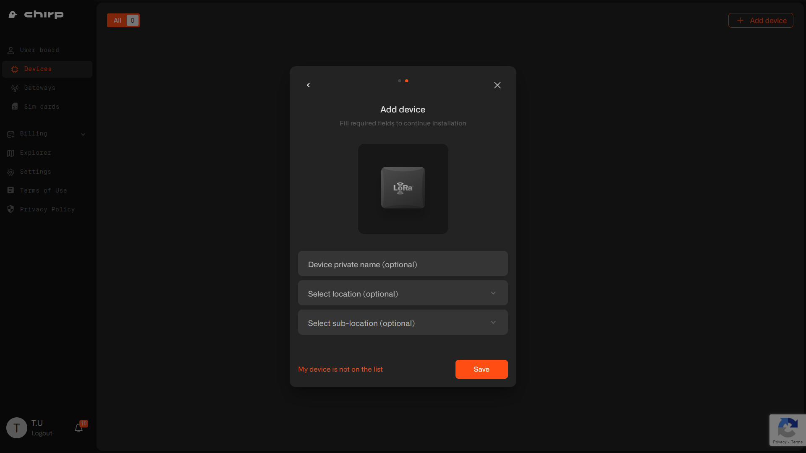

# Adding Device

Your miner comes with one of the many LoRaWAN-compatible sensors. These devices, unlike Wi-Fi, can operate at a significant distance from the miner, covering hundreds of meters and potentially supporting connections for other users within range. It’s essential to understand how the network works, as it is designed not only for miners but also for registered devices. We recommend registering the provided sensor, testing its capabilities, and exploring the network’s features.

To add a device to the network, go to the Dashboard and select the "Add Device" option in the upper-right corner of the page.

1. Select the "LoRaWAN Devices" option.
2. Enter the device’s manufacturer and model as indicated on the box.
3. Enter the `DevEUI` and `AppKey` listed on the device's box, and save them for future use. This information may be needed if you have to reconfigure the device, so it's recommended to record the sensor’s name or model and its location (e.g., "Temperature Sensor — Main Office, DevEUI xxxx, AppKey xxxx") in your documentation. Although this information is stored in the device, recovering it may require technical skills and depends on the manufacturer.

Add additional information, if necessary.

Your device added sucessfully.

