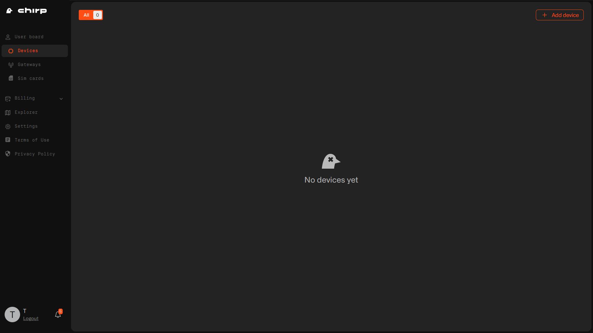

# Adding Device

With your miner, we've included a door sensor - just one of many LoRaWAN devices compatible with our network. Unlike WiFi devices, these have impressive range, working hundreds of meters away from the gateways, potentially benefiting your neighbors as Chirp clients without the need for additional gateways. Understanding the network's functions is vital for success, and our goal lies in registered devices, not just gateways. So register this device, test it out and understand the capabilities of the network. Keepers play a crucial role in spreading the word about the network's plug-and-play capabilities, benefiting everyone involved.

The door sensor is the Dragino LDS02.

To add it to the network, go to the Dashboard and select the "Add a Device" option located at the top right corner of the page.

Select "LoRaWAN Devices" option.

Choose Dragino as the vendor and LDS02 as the model. Input the `DevEUI` and `AppKey` found on the device's box, saving them for future reference.
In case you need to reprovision the device, these credentials are crucial. Note them down, for example, as `Main Door - Dragino LDS02, DevEUI xxxx, AppKey xxxx` in your documentation. While the information is stored on the device, retrieval requires technical knowledge and is different for all vendors, so it's wise to keep it handy.

Add additional information, if necessary.

Your device added sucessfully.

