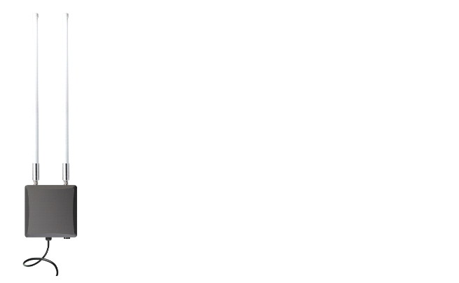
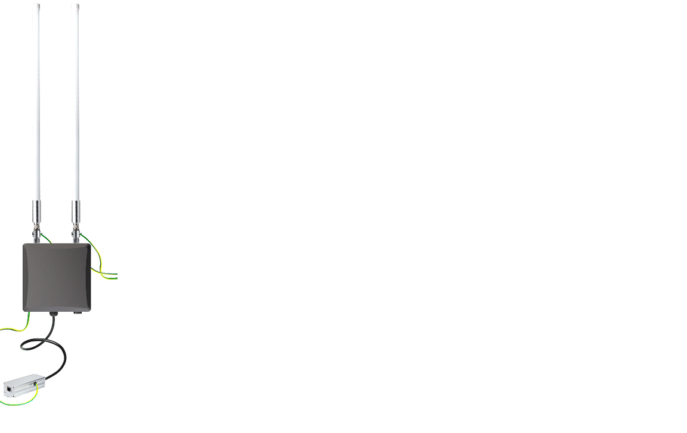
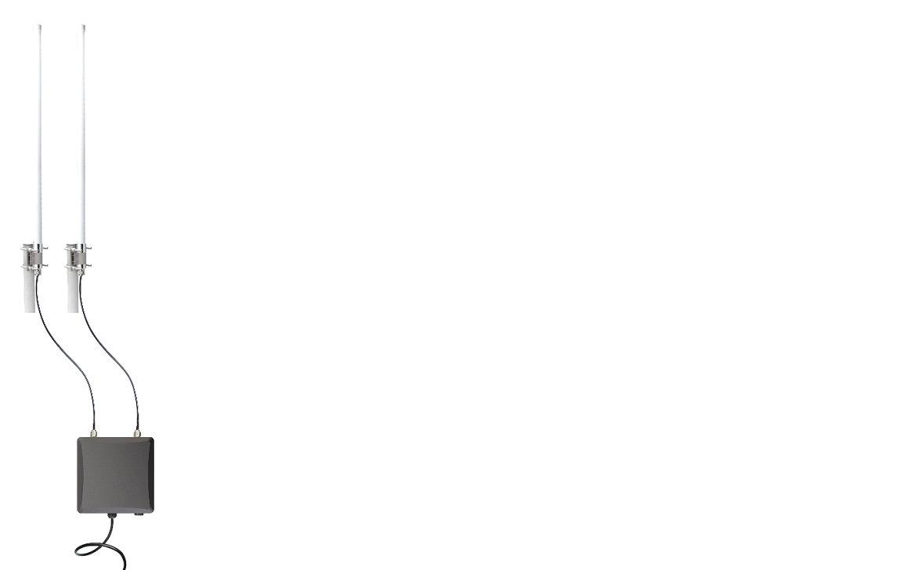
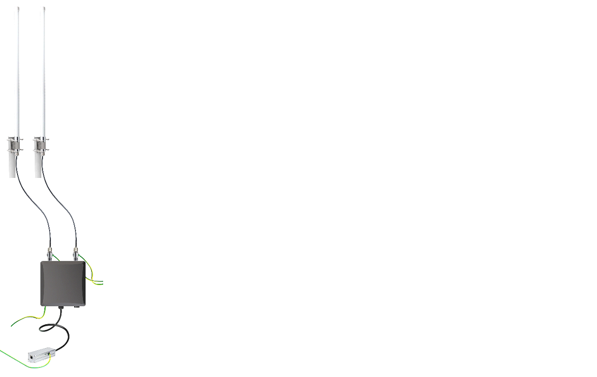

# Installation Scenarios

## Simple Antenna Mount

This is the simplest deployment solution where the antennas are mounted directly onto the gateway. This deployment type is suitable for areas with minimal obstructions where the gateway can easily communicate with the LPWAN devices and has no risk of lightning strikes ie (Balconies). 

 ## Simple Antenna Mount + Lightning protection (recommended)

This scenario involves deploying a LPWAN gateway in an urban or rural environment with the antennas directly mounted onto the gateway and includes lightning protection. This deployment type is suitable for areas with minimal obstructions where the gateway can easily communicate with the LPWAN devices but features a risk of lightning strikes ie Rooftops and Balcony rails (especially last floors). 
Lightning protection is essential for protecting the equipment:
⦁	Lightning arrestors are mounted between both antennas and the gateway and each of them is grounded to a grounding rail via the grounding wire.
⦁	The gateway itself is also grounded to the grounding rail via the grounding cable, mounted to the grounding bolt at the bottom of the enclosure.
⦁	An Ethernet Surge Protector is positioned between the gateway and the PoE injector and is grounded as well.

## Extended Position Antenna Kit

This scenario is applicable when you want better positioning of the antennas and there is no risk of lightning strikes. It involves deploying a LoRaWAN gateway with an antenna extension cable but without any lightning protection measures. This deployment type is suitable for areas where the antenna is lower than the surrounding buildings or structures, reducing the risk of lightning strikes.
Simply use the Pulsar cable to extend the connection between the antennas and the gateway as needed and use the A-fix brackets to secure the antennas.

## Extended Position Antenna Kit + Lightning protection

For better positioning of the antenna in an urban or rural environment, we present a solution that involves deploying a LPWAN gateway with an antenna extension cable and implementing lightning protection measures. This type of deployment is suitable for areas where the antenna is located at a higher elevation, increasing the risk of lightning strikes. The lightning protection measures will help prevent damage to the gateway and ensure its continued operation. 
Simply use the Pulsar cable to extend the connection between the antennas and the gateway as needed and use the A-fix brackets to secure the antennas.

Lightning protection is essential for protecting the equipment:
-	Lightning arrestors are mounted between both antennas and the gateway and each of them is grounded to a grounding rail via the grounding wire.
-	The gateway itself is also grounded to the grounding rail via the grounding cable, mounted to the grounding bolt at the bottom of the enclosure.
-	An Ethernet Surge Protector is positioned between the gateway and the PoE injector and is grounded as well.
