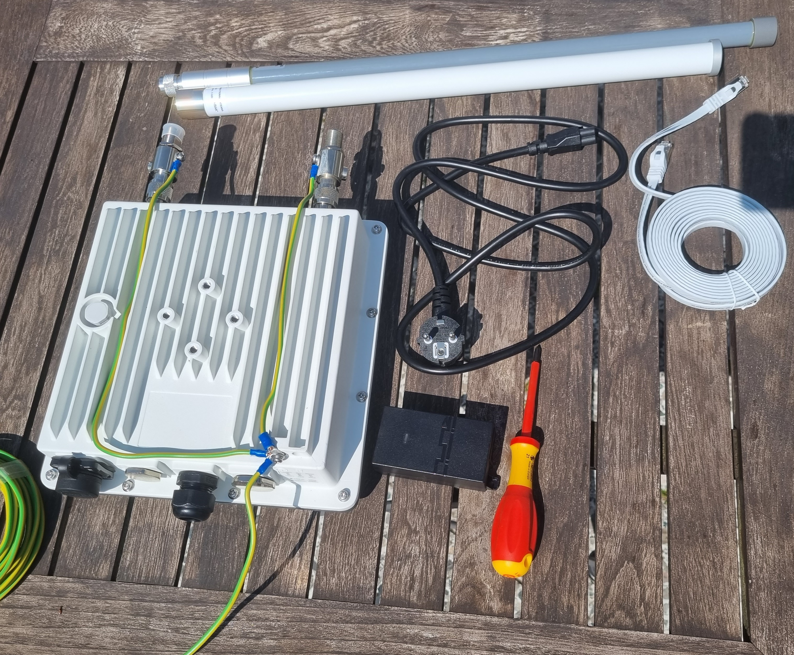
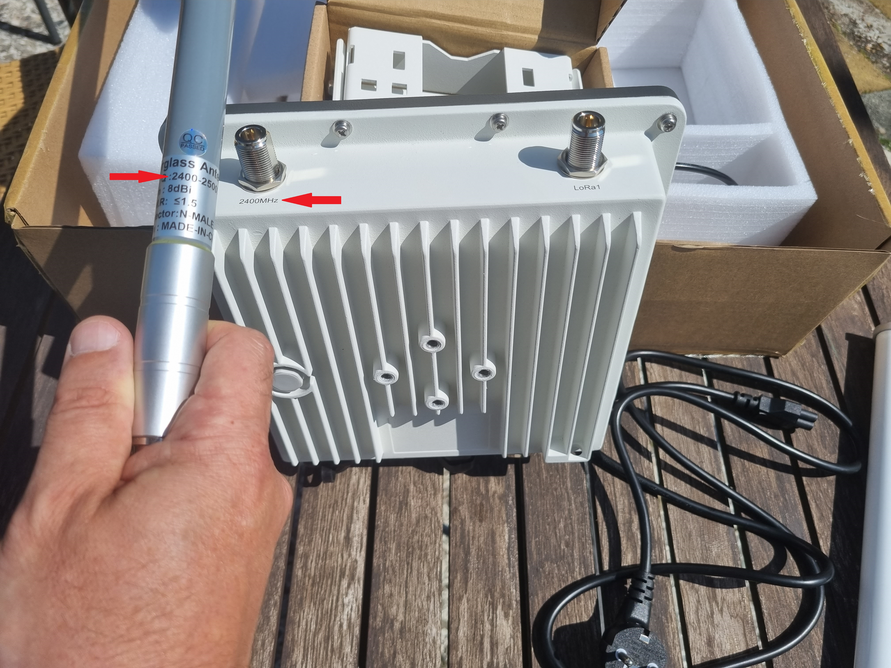
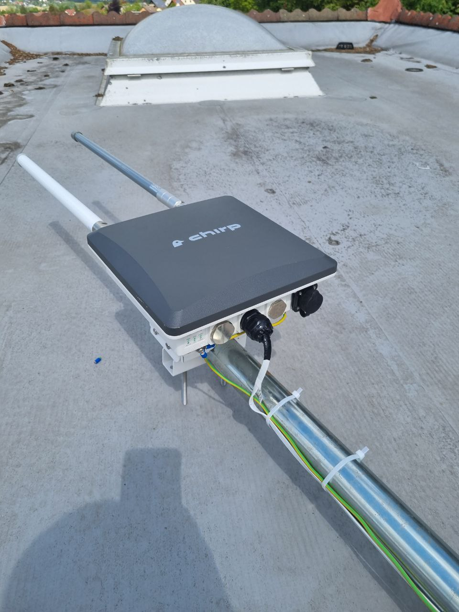
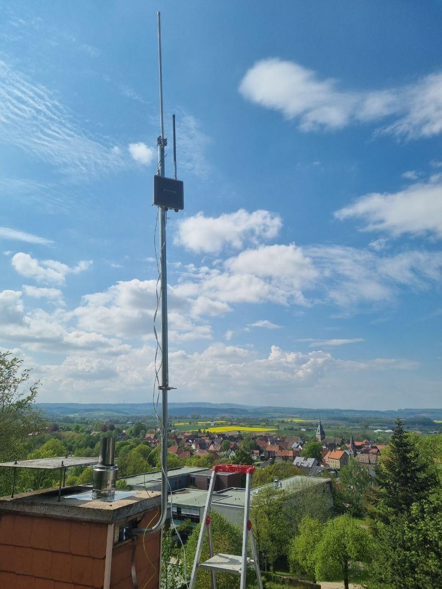
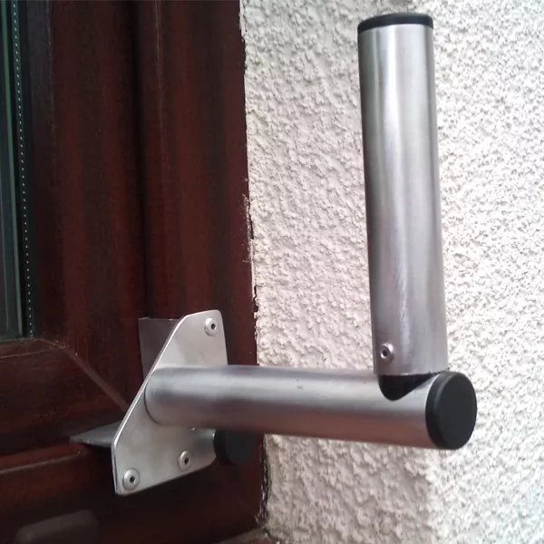
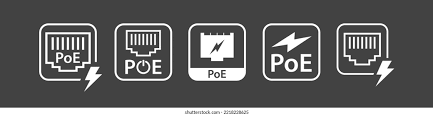

# Installation {#installation}

## Step One (Assemble the miner):

**IMPORTANT! Do not power on the miner until the antennas are attached to avoid damaging the concentrators.**

To assemble the miner, attach the antennas to the miner, ensuring that the antenna frequency matches the miner frequency. As miner are high-quality, expensive equipment, it is highly recommended to protect them from lightning and static. It is strongly suggested to install type N lightning arresters (male to female) (not included) between the antennas and the miner and ground the lightning arresters and the miner.

## Step Two (Grounding)

Ground the Lightning Arresters and the miner with a ground cable.

## Step Three (Attach the antennas)

Attach the antennas, ensuring they match the frequency.

## Step Four (Mount the miner)

You are now ready to mount.

To maximize rewards, it is advisable to mount the miner at the highest available point. By doing so, your miner will offer optimal coverage and increase the likelihood of detecting and connecting with other miners in the vicinity. This enhanced visibility and connectivity have the potential to generate higher rewards for your mining activities.

**When it comes to mounting a miner, it's crucial to consider the placement of its connection. Ensure that the connection is not obstructed or in a location where you might be tempted to unplug it, even for a short period of time. It's important to maintain a consistent and uninterrupted connection for optimal mining performance.
If the miner goes offline, it can have a significant impact on your reward coefficient. Therefore, it is essential to prioritize a stable and reliable connection to maximize your mining rewards.**

When it comes to mounting the miner, it's important to adhere to the guidelines for outdoor installations. Depending on the type of dwelling, specific rules apply:

### Single Family House

For single-family houses, only roof installations are permitted. This ensures optimal coverage and performance for the Chirp Wireless network. Make sure to choose a suitable location on the roof that provides a clear line of sight and minimizes obstructions.

### Apartment Complex

In an apartment complex, mounting the miner is limited to balconies or outside windows. These areas offer the necessary accessibility and positioning for the miner. It's important to find a suitable location that doesn't obstruct neighboring units and allows for a strong signal transmission.

By following these guidelines, you can ensure the proper installation and functioning of the Chirp Wireless miner, maximizing its efficiency and performance.

For a window mount the following [mount](https://www.wifi-shop24.com/antenna-mount-window-frame-15cm-aluminium) can be used that does not require drilling. (Flat ethernet cable can be used for data and power)

## Step Five (Connect the miner)

To power up your Blackbird and establish an internet connection, follow these steps:

If your router supports Power over Ethernet (PoE), (typically marked as follows)

connecting your miner is a breeze. You'll only need one network cable (not included) to go from your router to the miner. Simply connect one end of the network cable to an available LAN port on your router and the other end to the miner. This setup will provide both internet connectivity and power to your miner efficiently. Your Blackbird consumes on average 5W of power.

PoE Adaptor (Router without PoE Support):
In the event that your router does not support PoE, you can still power up your miner using a PoE adaptor included in the package. 

Here's how:

1. Connect one Ethernet cable from your router to the LAN port on the provided PoE adaptor.
2. Then, use another Ethernet cable to connect the PoE port on the adaptor to the miner.

Once connected you should see the LED lights on the bottom of the miner turn on.
