# Blackbird Registration

## Step One (Connect to the gateway's WiFi access point)

After properly mounting your gateway, take out your cellular phone and open the "WiFi Connections". If the gateway is powered on, you will see a WiFi access point named "Chirp-XXXX" (XXXX represents gateway-specific numbers). Connect your phone to this access point. Password is the same as the access point name Chirp-XXXX.

**It is strongly recommended to stay close to the gateway (around 5 meters) during the registration process to ensure a stable connection.**

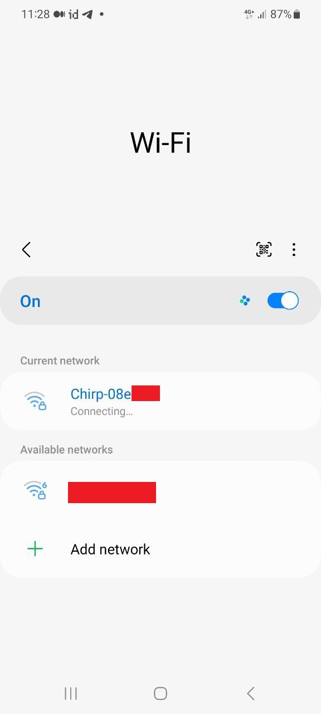

## Step Two (Open the gateway's access point in your browser)

Once successfully connected to the gateway's WiFi access point, open your internet browser and type the following IP address in the address bar: 192.168.230.1

## Step Three (Create a password for your gateway)

You will be prompted to create a password for your gateway. Enter password twice and click Next.

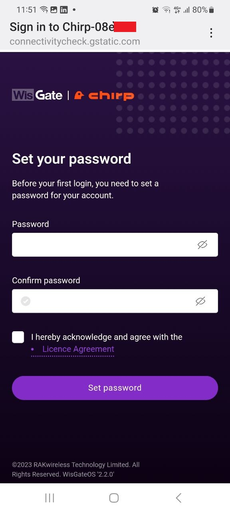

## Step Four (Select the gateway's primary connection type to the internet)

On the next screen, select the gateway's primary connection type to the internet. For these instructions, we will choose Ethernet. Click "Next."

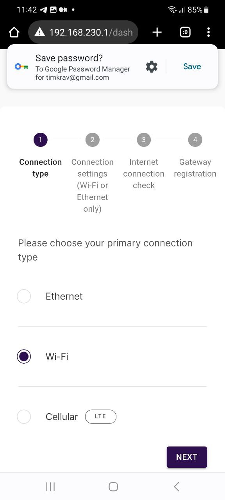

## Step Five (Configure the gateway's connection to the internet)

If you want to assign a static IP address or customize DNS fields, you can do so on this screen. If you are unsure about these settings, keep default and simply click "Next."

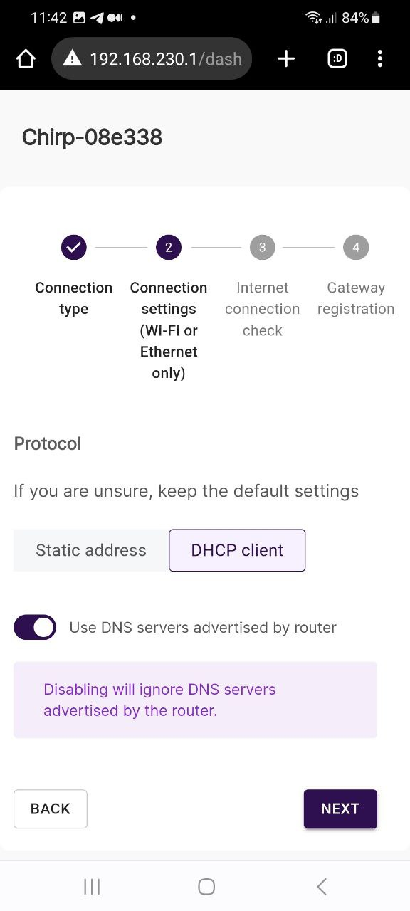

## Step Six (Confirm the internet connection)

The gateway will confirm the internet connection. Click "Next."

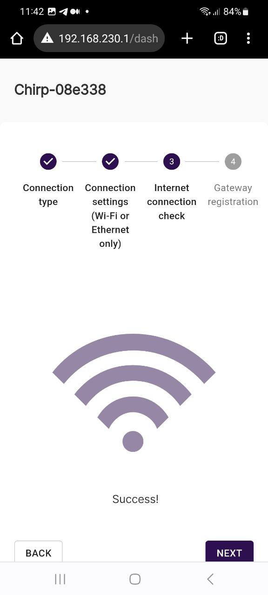

## Step Seven (Register the gateway)

This is the final step of registration through the gateway's access point. On this screen, you have the option to change the password for the gateway's access point "Chirp-XXXX" to enhance security. We recommend changing the password.
After changing the password open the Dashboard click the "Register" button.

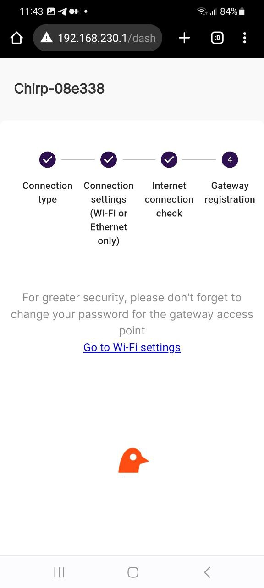

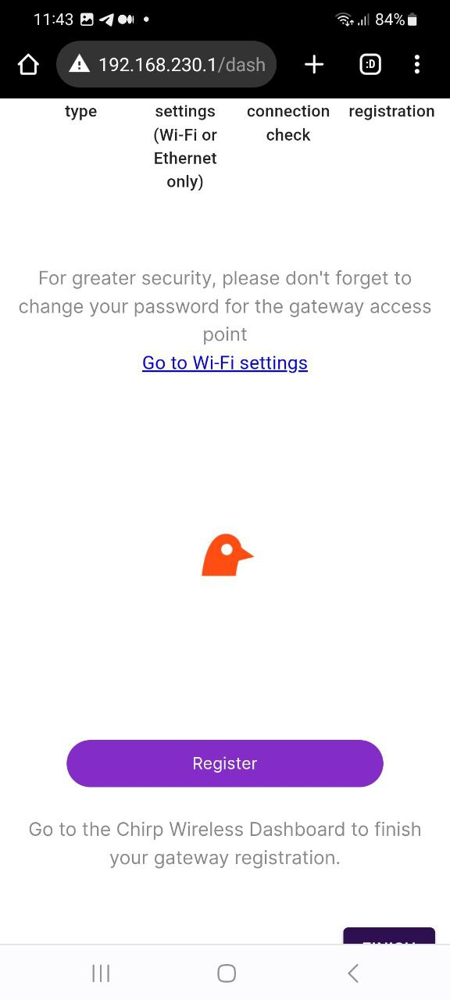

## Step Eight (Log into your Chirps Dashboard account)​

You will be redirected to the login screen of the Chirps Dashboard. Log into your Chirps Dashboard account, you already have it (this is where you redeemed your NFT).

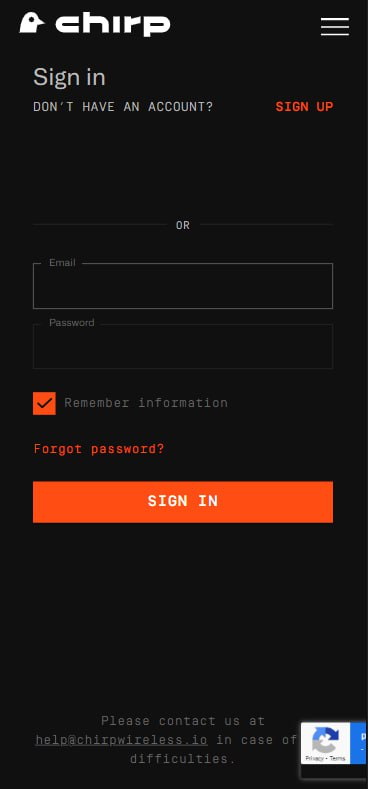

## Step Nine (Name your gateway)

After signing in, you will be prompted to name your gateway for your convenience. This allows you to differentiate between multiple gateway, such as Berlin Gateway, Washington Gateway, etc.

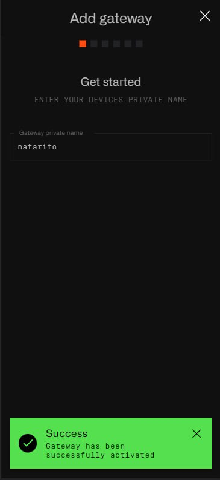

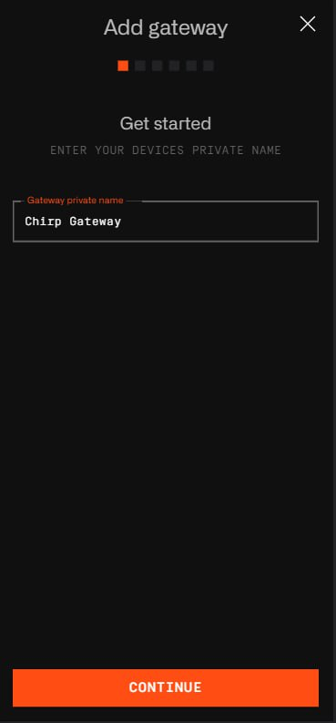

## Step Ten (Enrollment Fee Payment)

Once your Chirp gateway is installed, the next step is to pay the enrollment fee of $40. This fee covers the administrative and verification processes required for registration. Payment can be made through PayPal, which provides a secure and convenient payment platform.

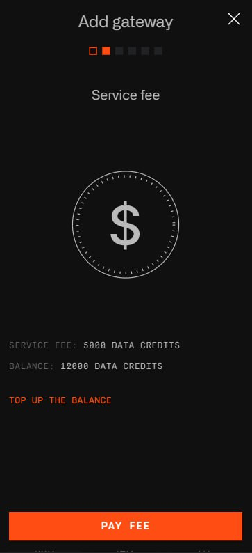

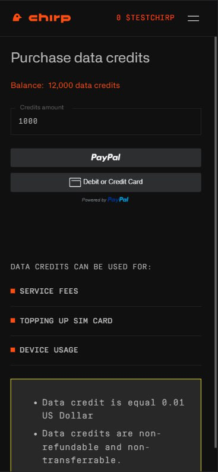

## Step Eleven (Submit pictures of the gateway and its installation)

Upload the pictures of the gateway and its installation that you took during the final step of gateway installation.

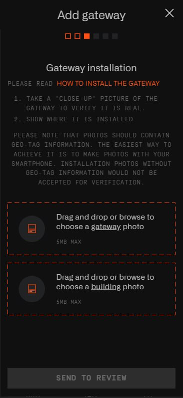

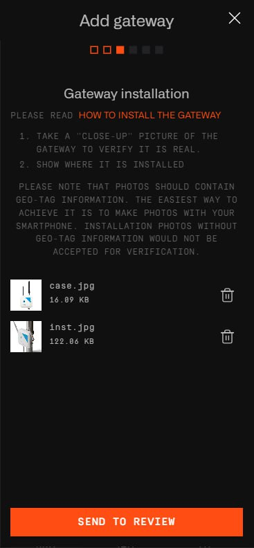

Click "Send to review". You will receive a message confirming the successful submission of the photos.

## Step Twelve (Set antennas settings)

Choose antenna`s height counting from the ground level and click "Continue"

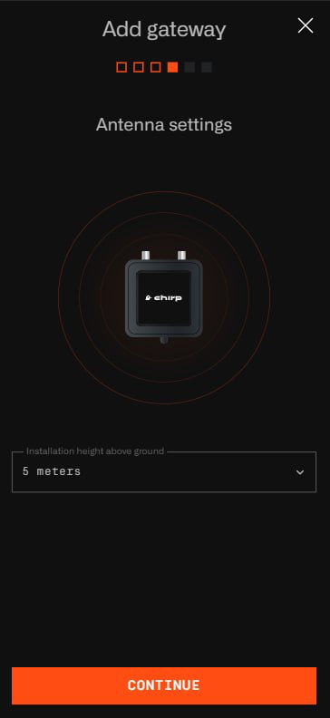

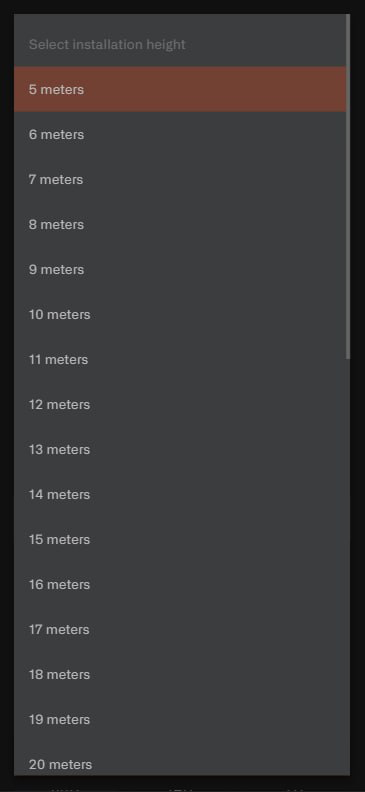

## Step Thirteen (Set approximate direction of antenna)

Choose antenna`s type and approximate direction on map and click "Continue"

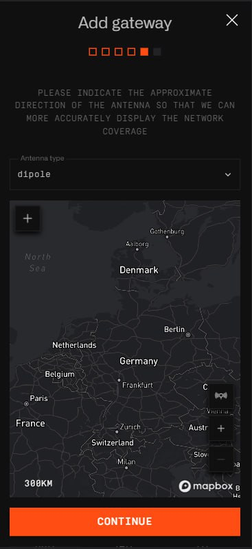

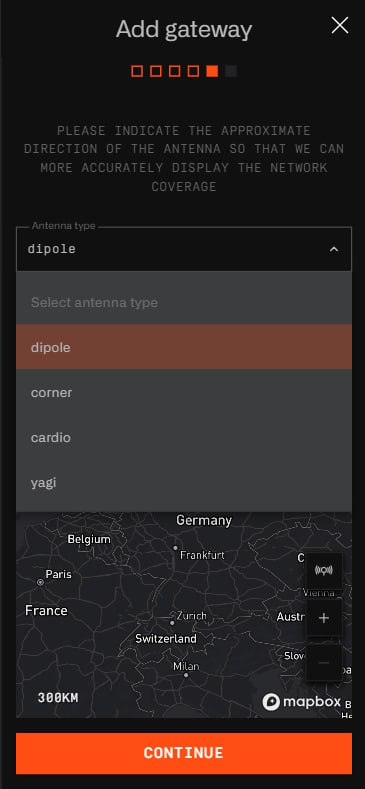

Now, wait for the approval of your gateway registration. Click "Finish registration".

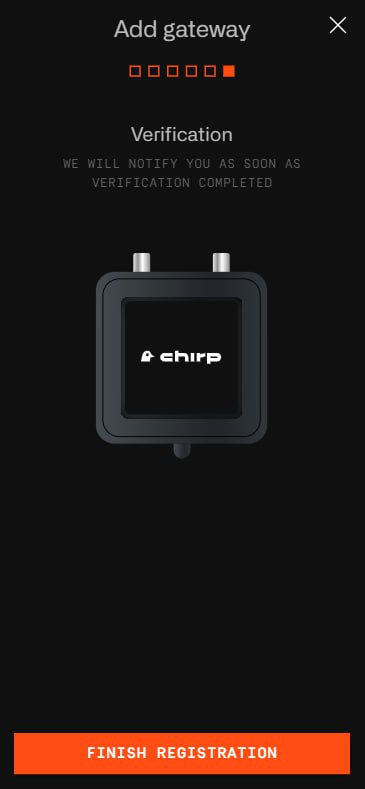

You will also receive an email associated with your account.

You can log into your dashboard to monitor the status of your installation approval.

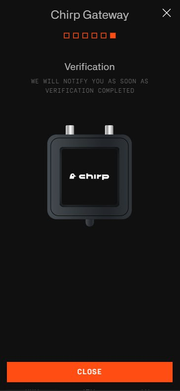
