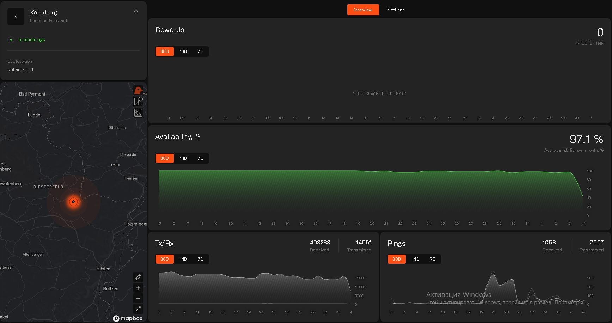
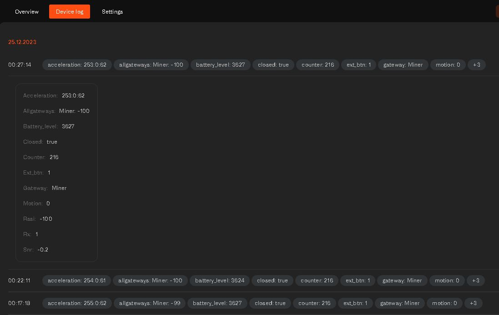

# Miner verification requirements:

## 1. Proper installation: 
Make sure to follow the detailed instructions provided in our quick start guide for installation. You can find the guide [here](4-installation)

## 2. Blackbird Registration: 
It is crucial to complete all the steps for Blackbird registration. For detailed instructions, please refer to our quick start guide [here](5-registration) 

## 3. Online status: 

Log in to the dashboard, navigate to the left menu, then go to Gateways. From there, choose the gateway you want by clicking on it. Once you see a green lightning symbol at the top left corner, it indicates that your miner is online. 
Furthermore, ensure that your miner is actively transmitting and receiving packets, as shown in the provided illustration.

## 4. Connect a lorawan device: 
Ensure that at least one lorawan device is connected to the network through the miner and successfully sending events to the dashboard.
To add Dragino door sensor LDS02, included in the package, follow the [link](6-adding-device)

When you tap on an event in the device log, you'll find detailed technical information that was received from your device. This includes the name of the miner that processed that specific event (gw parameter).

