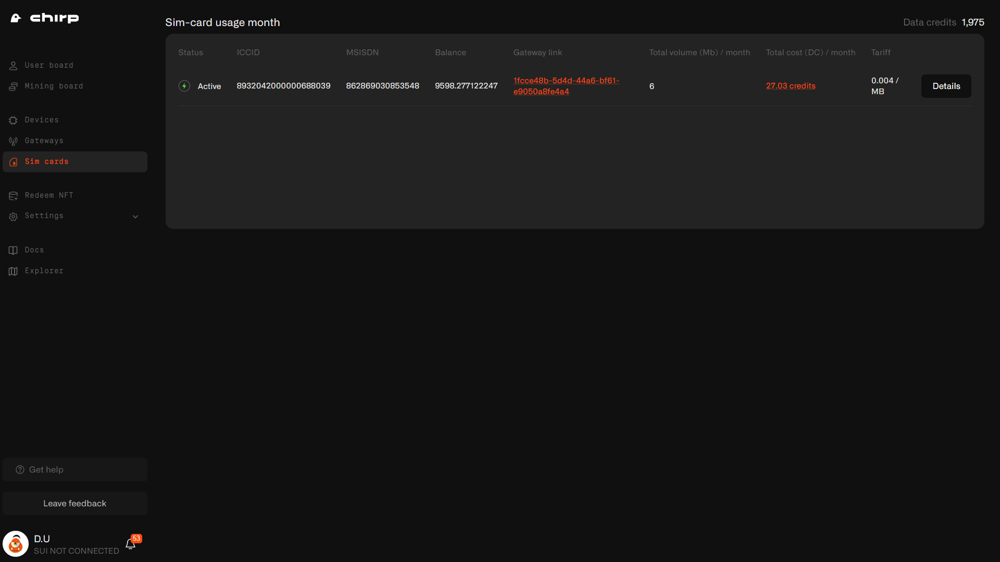
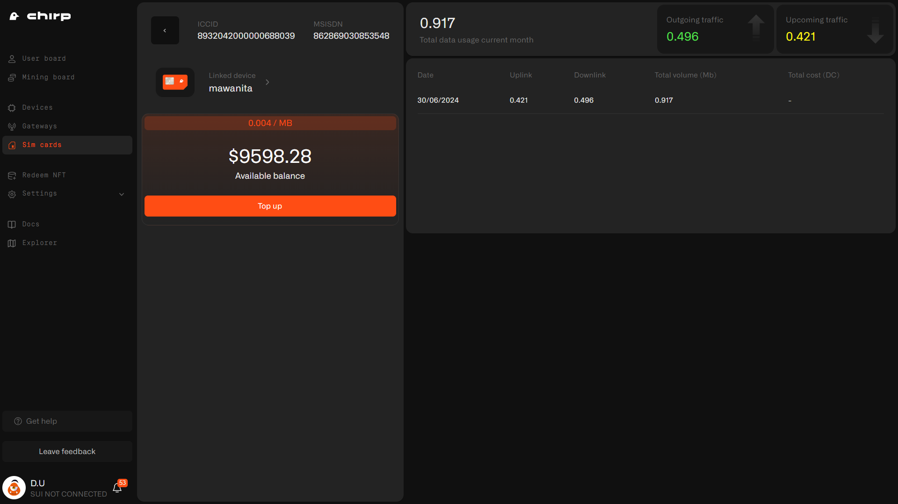
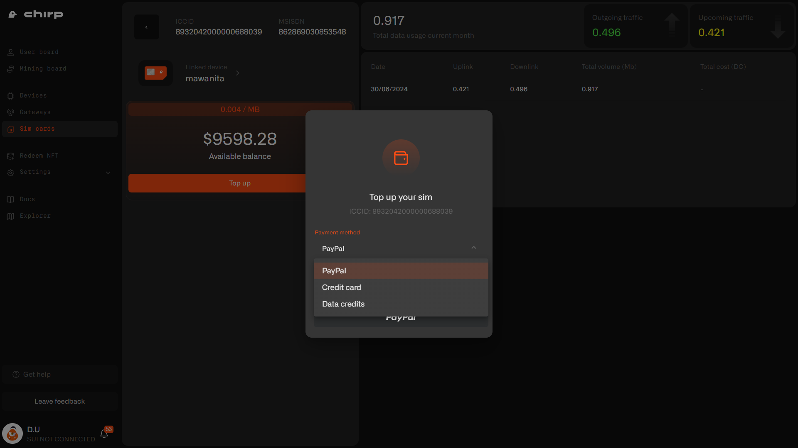
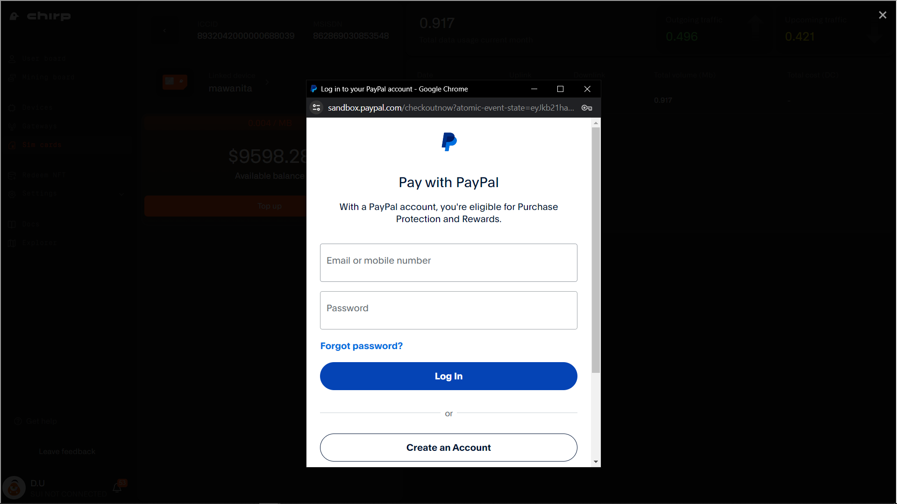
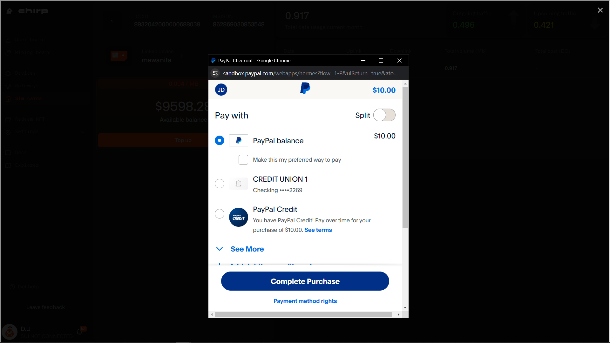
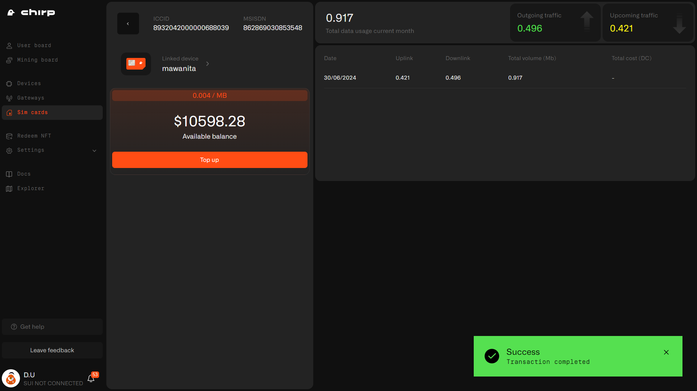
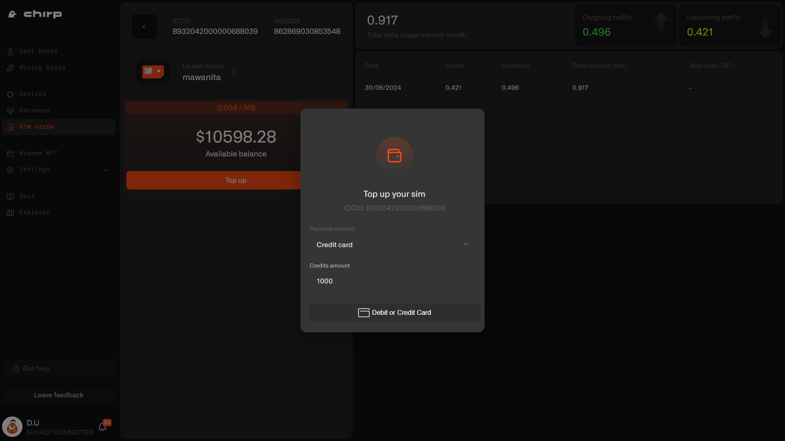
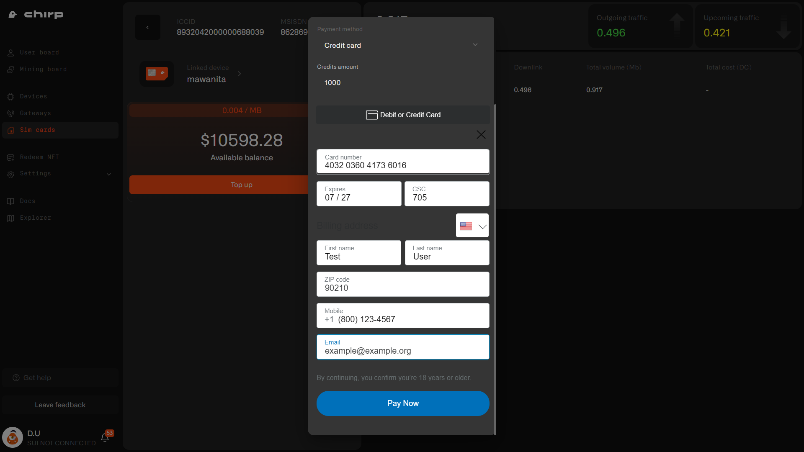
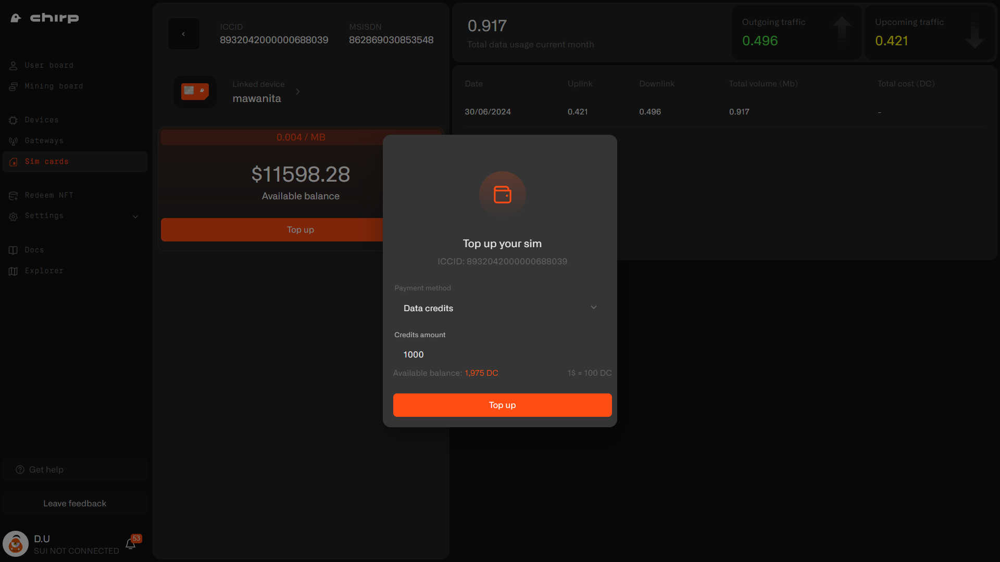

# Sim Card

Go to [https://app.chirpwireless.io/sim-cards](https://app.chirpwireless.io/sim-cards)

To check SIM, press Details button. There will be data usage info, linked device and top up options.

## Top up SIM balance

Select payment method to top up SIM balance: PayPal, Card or Data Credits.

### PayPal

Firstly, lets see PayPal. Choose amount to top up, press PayPal button.

Next you need to login into your account.

Once you logged in, proceed payment by clicking the Complete Purchase button.

If transaction successful, your SIM balance will be increased with 1000 data credits.

### Debit or Credit Card

If you want to top up the balance with card, choose amount to top up and press Debit or Credit card button.

Next you need to fill the payment form.

Once you are ready, press Pay Now button. If transaction successful, your balance will be increased with 1000 data credits.

### Data Credits

If you want to top up the balance with Data Credits, choose amount to top up and press Data Credits button. Choose amount to top up and press Top up button.

If transaction successful, your balance will be increased with 1000 data credits.

