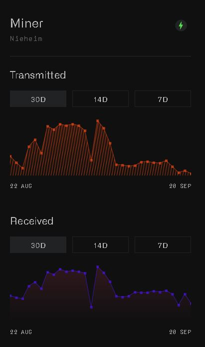
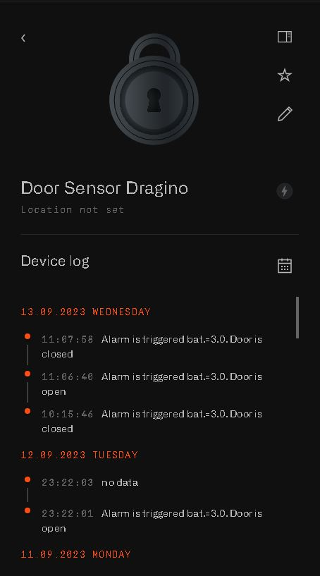

# Miner verification requirements:

## 1. Proper installation: 
Make sure to follow the detailed instructions provided in our quick start guide for installation. You can find the guide here: (Quick%20start%20guide/4-installation)

## 2. Blackbird Registration: 
It is crucial to complete all the steps for Blackbird registration. For detailed instructions, please refer to our quick start guide. 
You can find the guide here: (Quick%20start%20guide/5-registration)

## 3. Online status: 
Your miner should be actively transmitting and receiving packets, just like shown in the picture.

## 4. Connect a lorawan device: 
Ensure that at least one lorawan device is connected to the network through the miner and successfully sending events to the dashboard.

