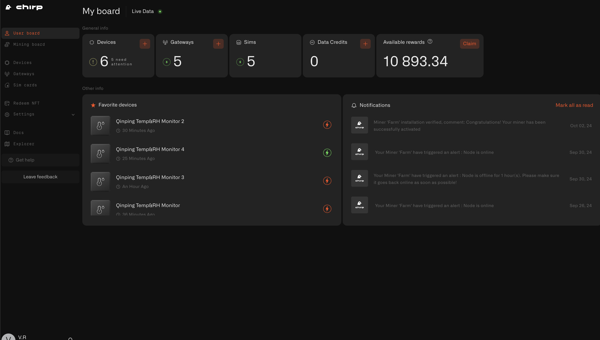
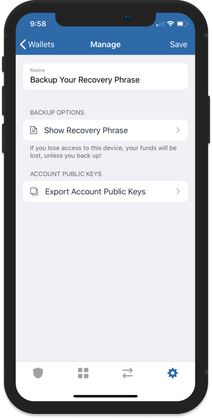
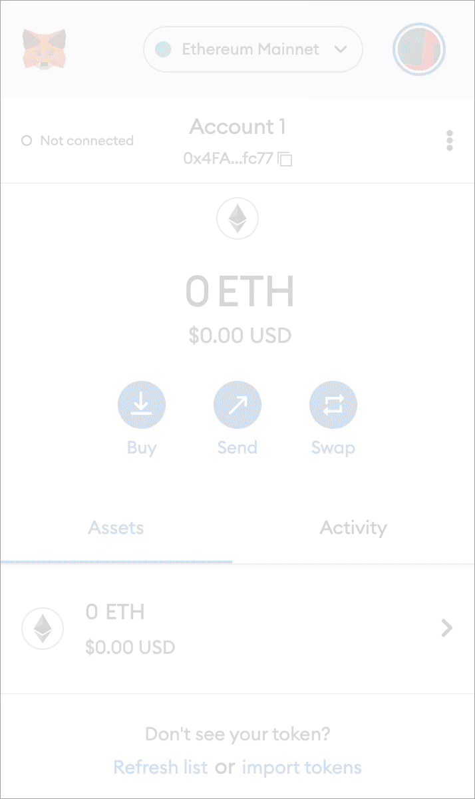
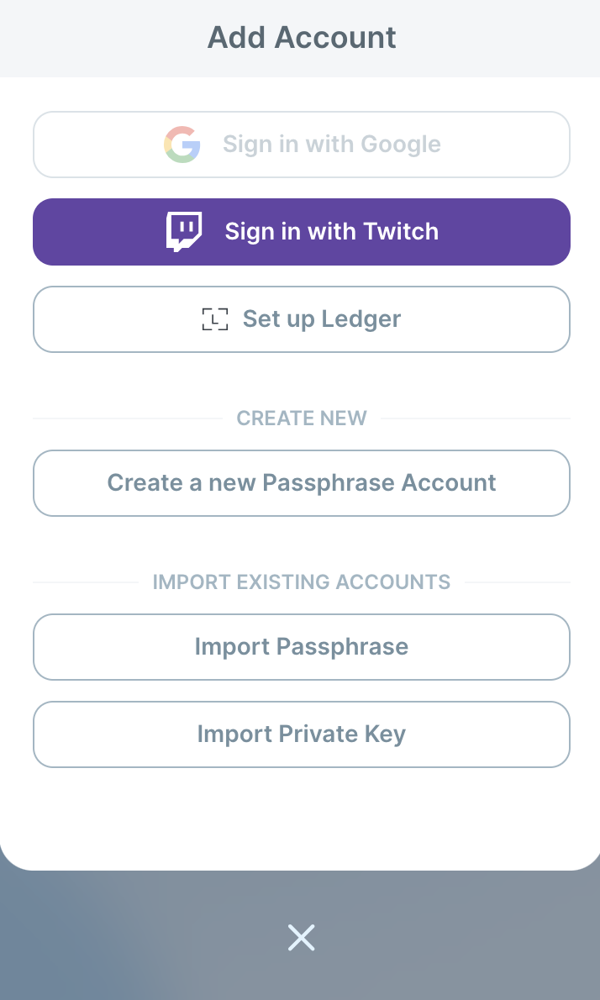
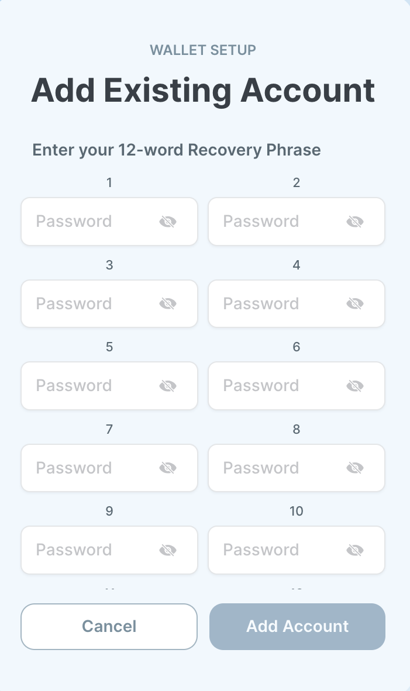

# Airdrop Rewards Claim

In this section, you will find out how to ensure that your CHIRP airdrops have been successfully sent to your Sui wallet and what to do if you're using a Sui wallet that is not supported by the Chirp platform. We'll guide you through the steps to verify your rewards and help you claim them seamlessly, regardless of the wallet you're using!

If are you using one of 4 Google Chrome extension wallets for Sui blockchain (i.e. Sui wallet) and your wallet is already connected to Chirp platform your available for claim CHIRP tokens will automatically appear in your Chirp account. You can navigate to the User board and claim your CHIRP airdrop.

If you are using Sui wallet that is not supported by Chirp platform you will need to
make a few additional simple steps to claim your CHIRP tokens.

First of all please ensure that your CHIRP airdrop was successfully deposited on the Sui wallet that you specified. Visit Suiscan and enter your wallet address in the search bar. Review your transaction history to confirm that the tokens were sent to your wallet. This step will help you verify that the tokens have been deposited to your wallet and all you need to do is complete a few simple steps described below to claim them on the Chirp platform.

## 0. Check for Tokens via SuiScan

Before importing the seed phrase and restoring your wallet in **Sui Wallet**, ensure that your tokens were sent to the correct address. You can easily check this using **SuiScan**.

**How to check transactions via SuiScan**:

1. Go to [SuiScan](https://suiscan.xyz/).
2. Enter your wallet address in the search bar.
3. Review your transaction history to confirm that the tokens were sent to your wallet.

This step will help you verify that the tokens are in your wallet, even if they haven’t appeared in your app yet. If the transaction was successful but the tokens are not visible in the wallet, you may need to add them manually.

## Why do you need to export a seed phrase?

Chirp platform currently supports 4 Google Chrome extension wallets for Sui blockchain (i.e. Sui wallet or Suiet, Ethos, and Wave) and in order to claim your CHIRP tokens you will need to export the seed phrase of the wallet where CHIRP airdrop was deposited and import it to one of these 4 Sui wallet extensions.

## 1. How to Export a Seed Phrase from Trust Wallet

1. **Open Trust Wallet**:
   - Launch the Trust Wallet app on your mobile device.
2. **Go to Settings**:
   - Tap on the settings icon in the lower right corner of the screen.
3. **Select the Desired Wallet**:
   - In the "Wallets" section, choose the wallet for which you want to create a backup of the seed phrase.
4. **Reveal the Recovery Phrase**:
   - Tap the **"Show Recovery Phrase"** option.
5. **Enter Password**:
   - You will be prompted to enter your password to confirm your identity.
6. **Write Down the Seed Phrase**:
   - Your 12-word seed phrase will appear on the screen. Write it down and store it in a safe place, ensuring no one else has access to it.
7. **Store Safely**:
   - Never share your seed phrase with anyone else and keep it stored securely. Losing the seed phrase may result in the permanent loss of access to your funds.

**Additional Information**:

This guide explains how to back up your seed phrase and why it's important to store it securely.

**Source:** [Trust Wallet: How to Back Up Your Recovery Phrase](https://community.trustwallet.com/t/backup-your-recovery-phrase-or-private-key/81996)

## 2. How to Export a Seed Phrase from MetaMask

1. **What is a Seed Phrase?**

   A seed phrase (recovery phrase) is a set of 12 words that you use to recover access to your MetaMask wallet in case you lose your password or device.

2. **How to Access the Seed Phrase**

- Open the MetaMask extension in your browser.
- Log into your account and go to **Settings** → **Security & Privacy**.
- Click **Reveal Secret Recovery Phrase** and enter your password for confirmation.
- Write down the recovery phrase and store it in a secure location.

1. **How to Export a Seed Phrase**You cannot directly export the seed phrase, but you can write it down:
   - Make sure to write it down on paper or store it in a secure digital format.
   - Keep the phrase stored in a secure place away from unauthorized access.

**Source:**

[MetaMask: How to Reveal Your Secret Recovery Phrase](https://support.metamask.io/ru/privacy-and-security/how-to-reveal-your-secret-recovery-phrase/)

---

## 3. How to Import a Seed Phrase into Sui Wallet

1. **Open Sui Wallet**

   Launch the Sui Wallet in your browser. You will see the "Add Account" screen.

2. **Select "Import Passphrase"**

   On the **"Add Account"** screen, select **"Import Passphrase"** under the **"Import Existing Accounts"** section.

3. **Enter Your Seed Phrase**

   On the next screen, you will be prompted to enter the 12 words of your seed phrase. Enter the words in the correct order.

4. **Confirm the Import**

   After entering all the words, click **"Add Account"** to complete the import process. Your wallet will be restored.

5. **Finish Setup**

   After a successful import, you may be asked to set up a new password to protect your wallet. Create a strong password and complete the setup.

   

   

---

## Conclusion

A seed phrase is the key to your cryptocurrency wallet. Whether you are using Trust Wallet, Ledger, MetaMask, or Sui Wallet, always follow security guidelines to protect your assets from potential loss.
