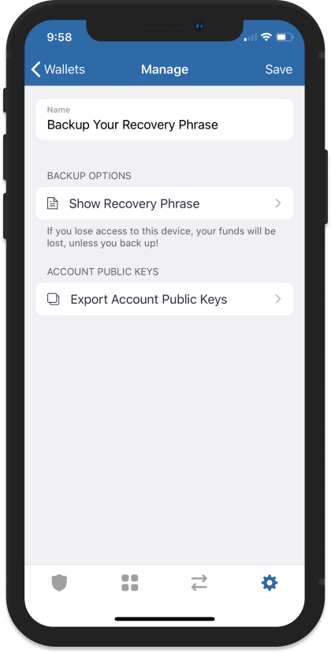
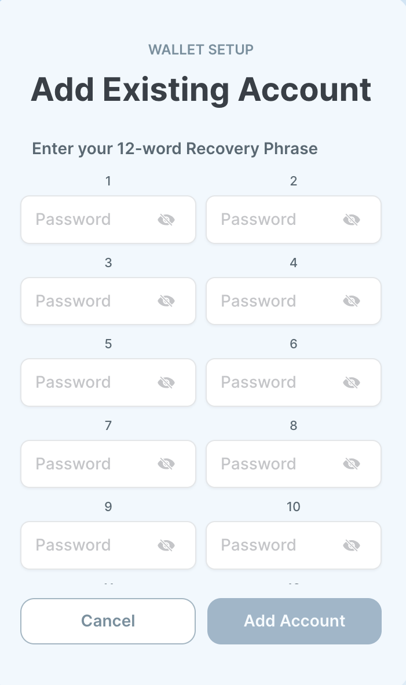

# How to Transfer a Seed Phrase to Sui Wallet for Rewards

## 0. Check for Tokens via SuiScan

Before importing the seed phrase and restoring your wallet in **Sui Wallet**, ensure that your tokens were sent to the correct address. You can easily check this using **SuiScan**.

**How to check transactions via SuiScan**:

1. Go to [SuiScan](https://suiscan.xyz/).
2. Enter your wallet address in the search bar.
3. Review your transaction history to confirm that the tokens were sent to your wallet.

This step will help you verify that the tokens are in your wallet, even if they haven’t appeared in your app yet. If the transaction was successful but the tokens are not visible in the wallet, you may need to add them manually.

---

- **How to Manually Add a Token to Your Wallet**

Sometimes after receiving tokens, they may not appear in your wallet by default. In this case, you can add the token manually. Below are examples for **Trust Wallet** and **MetaMask**.

- **Adding a Token in Trust Wallet**:

1. Open the **Trust Wallet** app.
2. Tap the icon in the top right corner of the screen (usually the search token icon).
3. Scroll down and select the option **Add Token**.
4. Enter the **token address**, its **symbol** (e.g., "XYZ"), and the number of **decimals**.
5. Tap **Save**. Your tokens will now appear in your wallet.
   - **Adding a Token in MetaMask**:
6. Open **MetaMask** in your browser or app.
7. Go to the **Assets** section.
8. Click on the **Import Token** button.
9. Enter the **token contract address**, the token symbol (e.g., "XYZ"), and the number of decimals.
10. Click **Add**. The token will now appear in your asset list.

---

## Why do you need to export a seed phrase?

**Chirp platform currently supports only 4 Sui wallets: Sui, Suiet, Ethos, and Wave. To be able to claim your tokens, you need to use one of the wallet extensions mentioned above.**

## 1. How to Export a Seed Phrase from Trust Wallet

1. **Open Trust Wallet**:
   - Launch the Trust Wallet app on your mobile device.
2. **Go to Settings**:
   - Tap on the settings icon in the lower right corner of the screen.
3. **Select the Desired Wallet**:
   - In the "Wallets" section, choose the wallet for which you want to create a backup of the seed phrase.
4. **Reveal the Recovery Phrase**:
   - Tap the **"Show Recovery Phrase"** option.
5. **Enter Password**:
   - You will be prompted to enter your password to confirm your identity.
6. **Write Down the Seed Phrase**:
   - Your 12-word seed phrase will appear on the screen. Write it down and store it in a safe place, ensuring no one else has access to it.
7. **Store Safely**:
   - Never share your seed phrase with anyone else and keep it stored securely. Losing the seed phrase may result in the permanent loss of access to your funds.

**Additional Information**:

This guide explains how to back up your seed phrase and why it's important to store it securely.

**Source:** [Trust Wallet: How to Back Up Your Recovery Phrase](https://community.trustwallet.com/t/backup-your-recovery-phrase-or-private-key/81996)

---

## 2. How to Export a Seed Phrase from Ledger

1. **What is a Seed Phrase?**

   A seed phrase (or recovery phrase) is a set of 24 words generated when setting up your Ledger device. It is used to recover access to your wallet in case the device is lost or reset.

2. **Accessing the Seed Phrase**

   Ledger does not allow you to view the seed phrase after the initial setup. If you haven’t saved it, you won’t be able to recover your wallet later.

   - If you lose the seed phrase, you won’t be able to access the funds in your wallet. In this case, you will need to reset the device and create a new wallet.

3. **How to Export a Seed Phrase**

   While the seed phrase cannot be exported directly, you can reset the device and create a new wallet:

   1. **Reset the Device**:
      - Open the Ledger Live app and go to device settings.
      - Choose the reset option to erase all data.
   2. **Create a New Wallet**:
      - Follow the on-screen instructions to set up a new wallet with a new seed phrase. Write it down and store it securely.

4. **Seed Phrase Security**

- Never share your seed phrase with anyone.
- Store the seed phrase securely to avoid losing access to your funds.

**Additional Reference Links**:

- [How to Manage Your Seed Phrase in Ledger](https://support.ledger.com/article/4404382560913-zd)
- [Seed Phrase Backup Recommendations](https://support.ledger.com/article/8154109204509-zd)

---

## 3. How to Export a Seed Phrase from MetaMask

1. **What is a Seed Phrase?**

   A seed phrase (recovery phrase) is a set of 12 words that you use to recover access to your MetaMask wallet in case you lose your password or device.

2. **How to Access the Seed Phrase**

- Open the MetaMask extension in your browser.
- Log into your account and go to **Settings** → **Security & Privacy**.
- Click **Reveal Secret Recovery Phrase** and enter your password for confirmation.
- Write down the recovery phrase and store it in a secure location.

1. **How to Export a Seed Phrase**You cannot directly export the seed phrase, but you can write it down:
   - Make sure to write it down on paper or store it in a secure digital format.
   - Keep the phrase stored in a secure place away from unauthorized access.

**Source:**

[MetaMask: How to Reveal Your Secret Recovery Phrase](https://support.metamask.io/ru/privacy-and-security/how-to-reveal-your-secret-recovery-phrase/)

---

## 4. How to Import a Seed Phrase into Sui Wallet

1. **Open Sui Wallet**

   Launch the Sui Wallet in your browser. You will see the "Add Account" screen.

2. **Select "Import Passphrase"**

   On the **"Add Account"** screen, select **"Import Passphrase"** under the **"Import Existing Accounts"** section.

3. **Enter Your Seed Phrase**

   On the next screen, you will be prompted to enter the 12 words of your seed phrase. Enter the words in the correct order.

4. **Confirm the Import**

   After entering all the words, click **"Add Account"** to complete the import process. Your wallet will be restored.

5. **Finish Setup**

   After a successful import, you may be asked to set up a new password to protect your wallet. Create a strong password and complete the setup.

   

   

---

## Conclusion

A seed phrase is the key to your cryptocurrency wallet. Whether you are using Trust Wallet, Ledger, MetaMask, or Sui Wallet, always follow security guidelines to protect your assets from potential loss.
