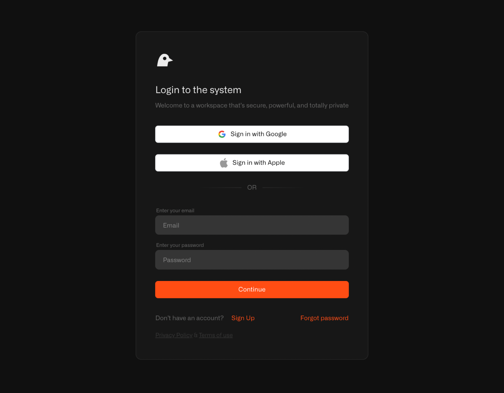
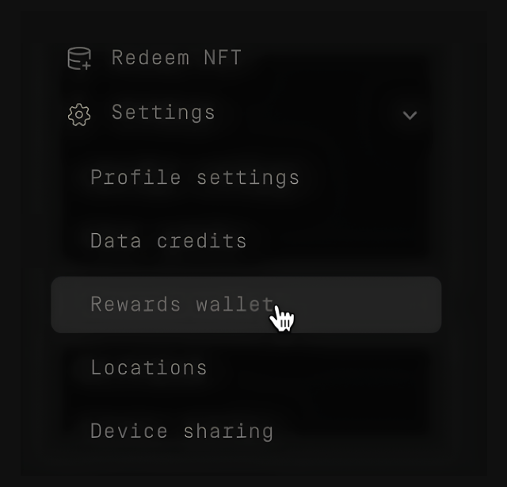
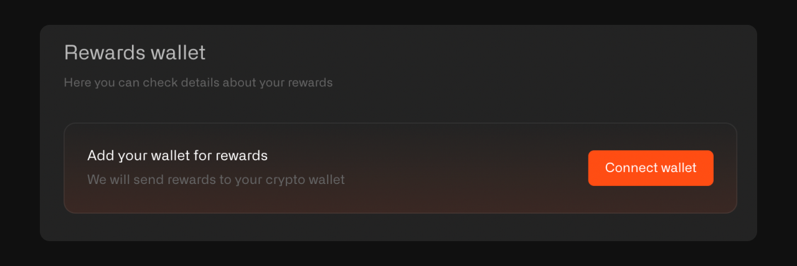
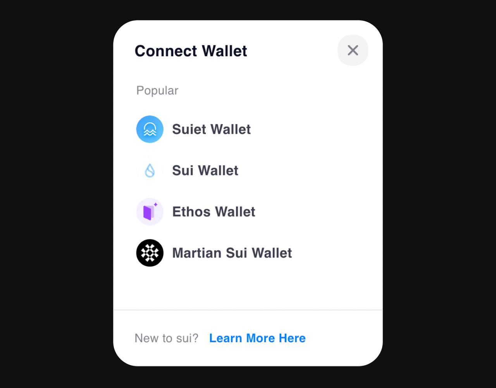
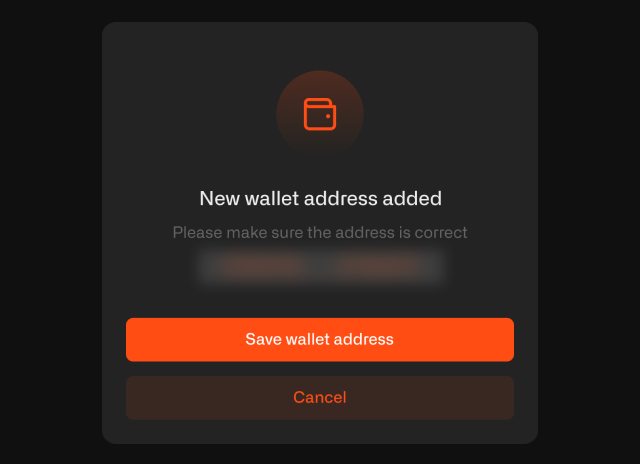
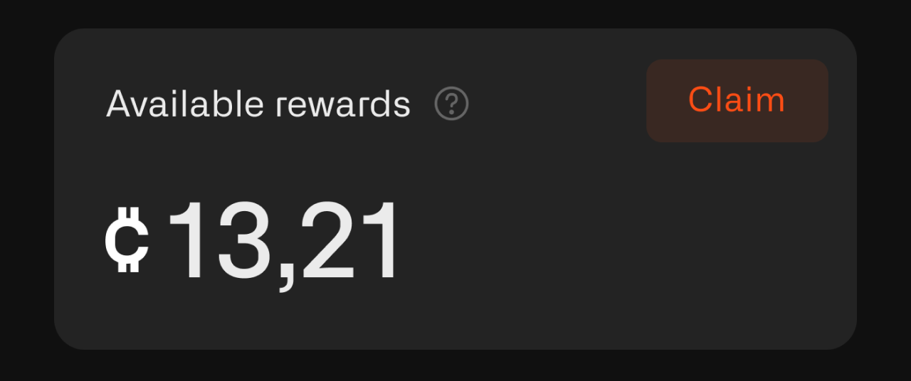
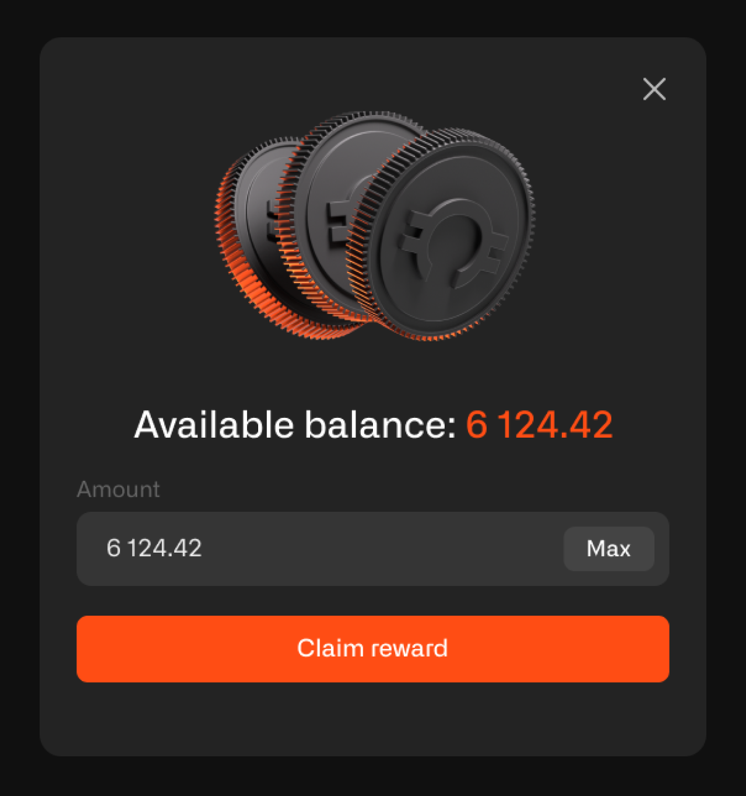

# How to Connect Your Wallet and Withdraw Tokens

To claim your rewards, you need to connect your Sui wallet to the Chirp platform.

**Important**: Wallet connection, disconnection, and rewards claims are only available through the Sui extension on a desktop, as the Sui wallet can only be connected via the desktop version.

## What's a Sui wallet?

A Sui wallet is like a digital bank account for your tokens. The Sui wallet is a specific type of wallet that you need to install in your browser.

Even if you're not familiar with cryptocurrency wallets, don't worry — just follow these steps:

## Steps to Connect Your Wallet and Withdraw Tokens

### 1. Go to the Chirp platform

- On your computer, open your internet browser (like Chrome, Firefox, or Safari).
- Go to [app.chirpwireless.io](https://app.chirpwireless.io).

### 2. Log in to your account using the same ID you use in the game

- Use the same username and password that you created when signing up for the Kage game.
- If you forgot your password, look for the "Forgot Password" link and follow the steps to reset it.

### 3. Connect your Sui wallet

- Once logged in, go to **Settings -> Rewards Wallet** from the side menu.

- Click the **"Connect wallet"** button.

- You’ll be shown a range of wallets. Please choose the one that suits you. We recommend Sui and Suiet wallets. Then, confirm sharing your wallet address in the wallet app.

After this, you should see a message confirming that the wallet was successfully added. Next, you need to verify it. You will be redirected to Sui, where you should press the **"Sign"** button. Once this is done, the wallet will be added to your account on the Chirp platform and Kage game.

### 4. Check Claimable Rewards

- After successfully connecting your wallet, go to the **Userboard** page.
- In the **General info** section, you’ll see the number of tokens available for claiming.

### 5. Withdraw tokens

- To transfer your earned tokens to your Sui wallet, click the **“Claim reward”** button.

- Enter the number of tokens you want to withdraw, or simply click the **“Max”** button to withdraw the maximum number of tokens to your wallet.

## What happens next?

CHIRP tokens will be transferred to your Sui wallet, where you can hold onto them, use them for Chirp platform features, or eventually convert them through a cryptocurrency exchange.

## Need help?

If you're unsure about any of these steps, or if something isn't working, don't hesitate to reach out to Chirp's support team. We are here to help you every step of the way!
