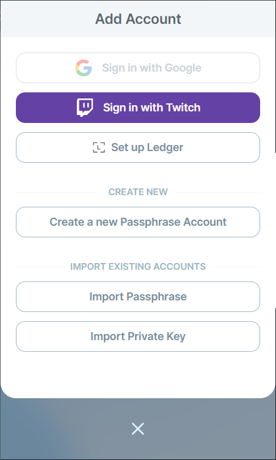
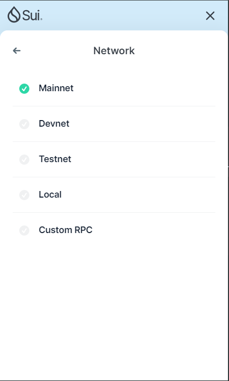
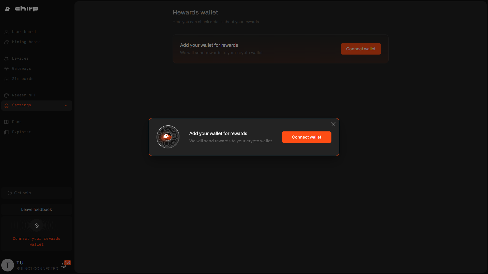
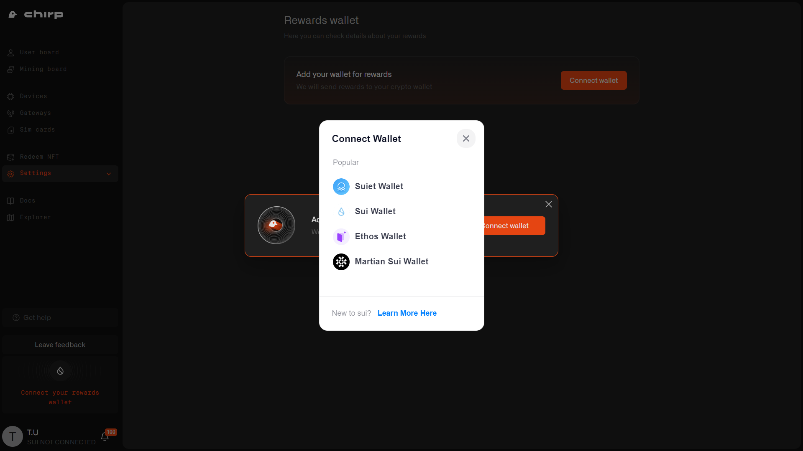
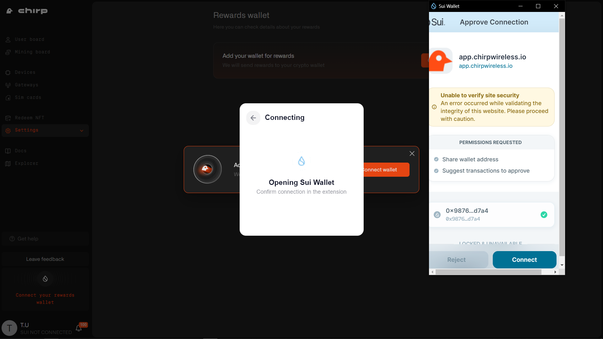
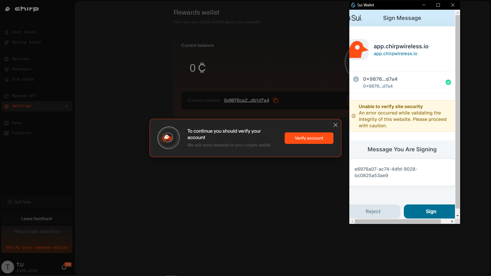
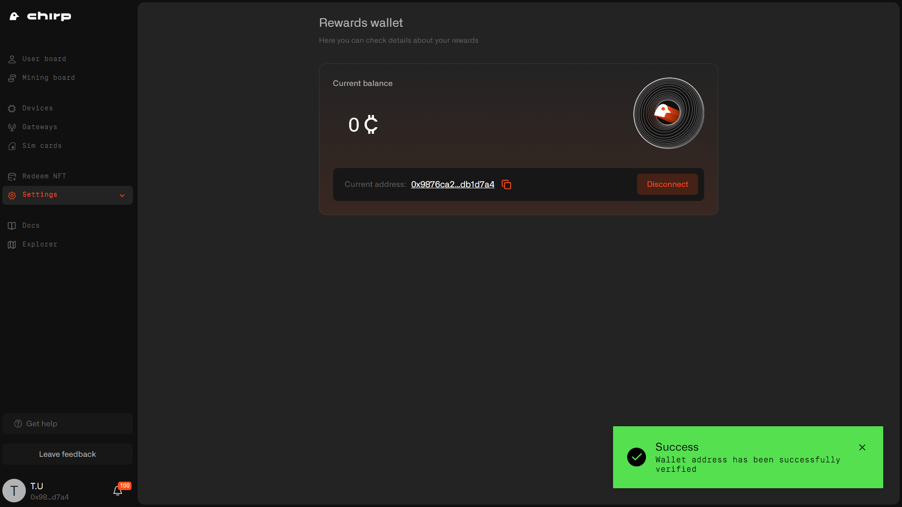

# Sui Wallet

To interact with the Chirp platform and be able to earn and further claim CHIRP rewards, you'll need to create and connect Sui wallet to Chirp.

## Sui Wallet creation

Please bear in mind that currently Chirp platform supports these 4 Google chrome wallet extensions - Sui, Suiet, Ethos, and Martian Sui. So choose one of them to be able to interact with the Chirp platform. If you already use other wallets or platforms for interacting with Sui blockchain - visit our guideline on how to export your seed phrase.

To create a reward wallet, please install one of 4 Google Chrome extension wallets for Sui blockchain (i.e. Sui wallet). After installation is complete, create your personal Sui wallet. You can create it with your Google account, but for improved security we recommend using a method with the “passphrase”.

When wallet is created check if the Mainnet is selected

## Sui Wallet connection to Chirp

When your Sui wallet is set up please navigate to [https://app.chirpwireless.io](https://app.chirpwireless.io). Sign up if you are new to Chirp or sign in into your Chirp account. After, go to the Settings section in the menu, choose Rewards wallet and click on Connect wallet button.

Select a wallet extension you have installed.

Next you need to choose the correct wallet address and click Connect.

Confirm wallet by clicking the Save wallet address button.

To verify a reward wallet, you need to sign message with your wallet, click Sign.

After that your rewards wallet is set and verified.

