# Rewards

## Create rewards wallet

To create a reward wallet, please install Google Chrome extension for Sui wallet (i.e. [Sui wallet](https://chromewebstore.google.com/detail/sui-wallet/opcgpfmipidbgpenhmajoajpbobppdil)). Next you need to create an account, if you do not have already or import an account with seed phrase.

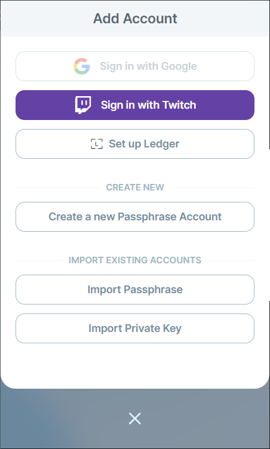

Next please select Mainnet in wallet extension settings.

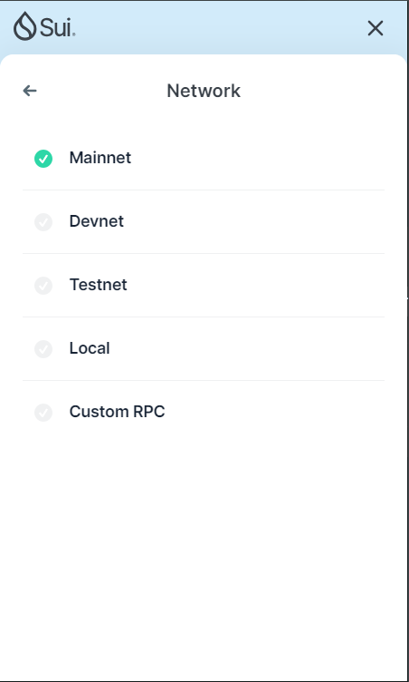

## Connect rewards wallet

To connect a reward wallet, navigate to [https://app.chirpwireless.io](https://app.chirpwireless.io) and sign-in or sign-up. After logging in press Connect your rewards wallet button and connect wallet.

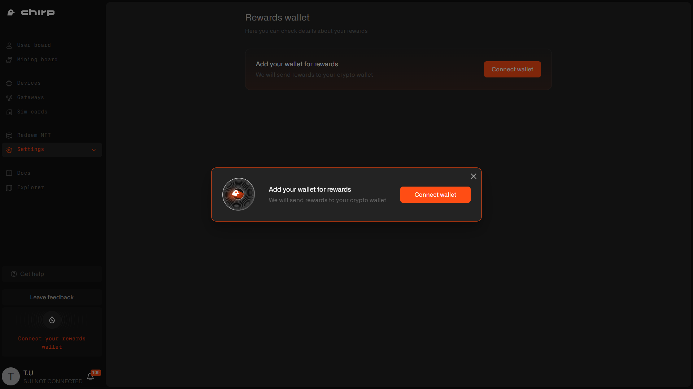

Select a wallet extension you have installed.

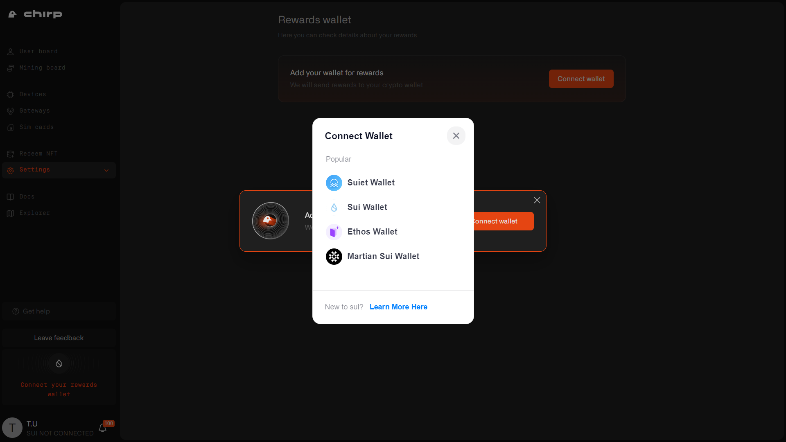

Next you need to choose a correct wallet address and click Connect.

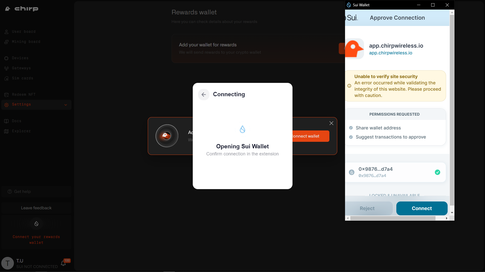

Confirm wallet by click Save wallet address button.

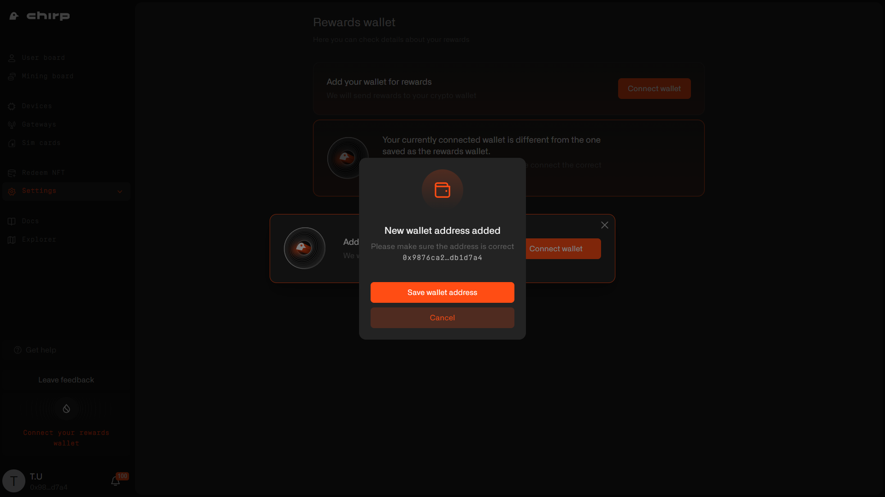

## Verify rewards wallet

To verify a reward wallet, you need to sign message with your wallet, click Sign.

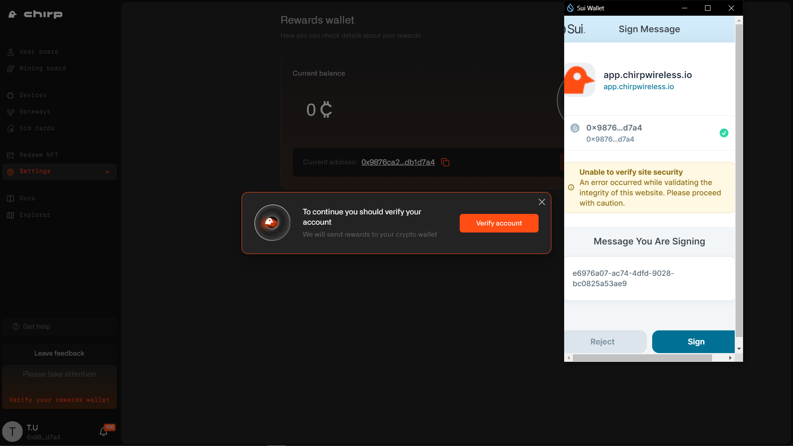

After that your rewards wallet is set and verified.

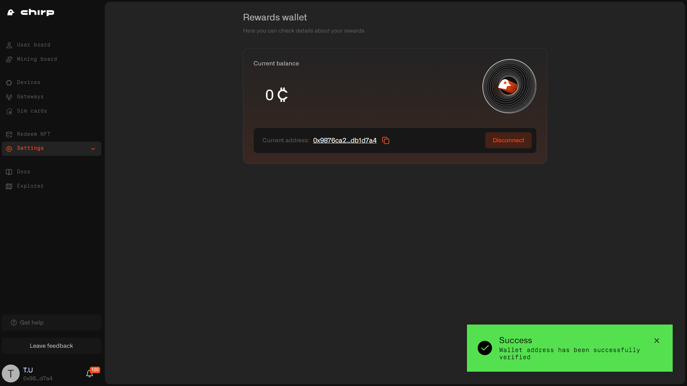

## Claim rewards

To claim the rewards, please navigate to [https://app.staging.chirpwireless.io/mining](https://app.staging.chirpwireless.io/mining). Press Claim Rewards button.

**NB: rewards claiming is currently available in testnet, do not forget to switch network in wallet extension to Testnet.**

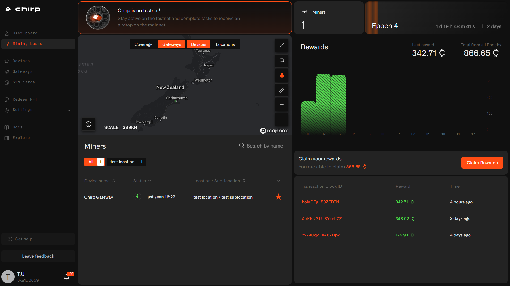

Choose an amount of tokens to claim or press Max button, if you want to claim all the tokens and then press Claim reward.

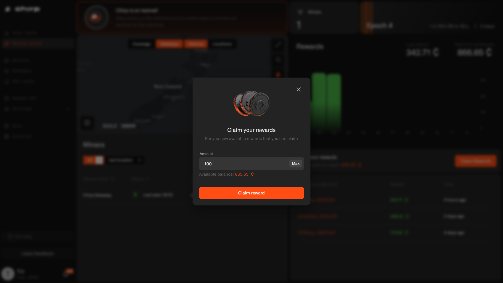

Next you need to approve a transaction in wallet extension. Press Approve button.

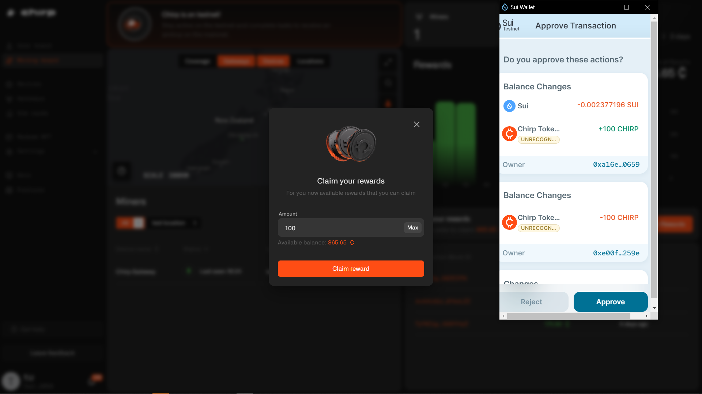

Finally, you will receive tokens to rewards wallet. Congratulations!

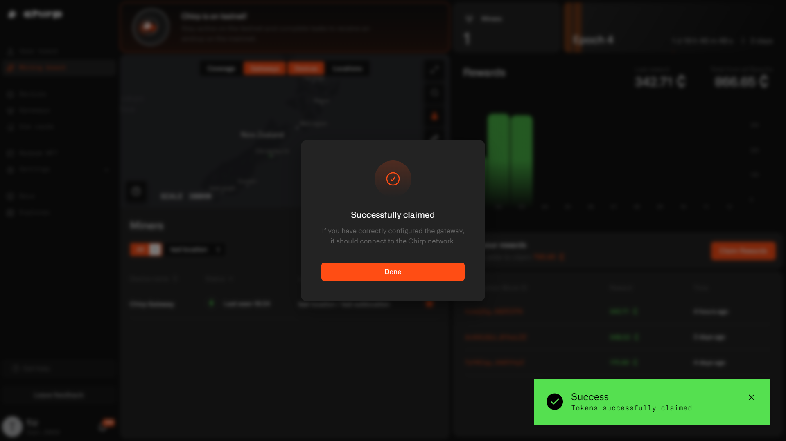
