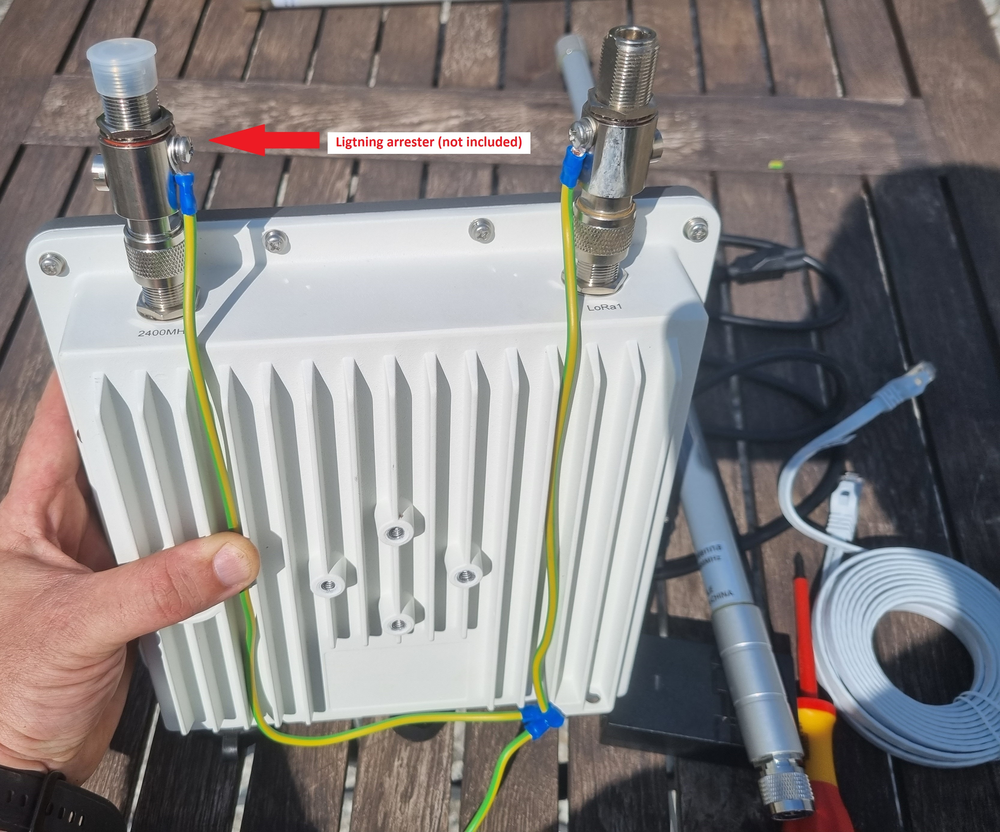
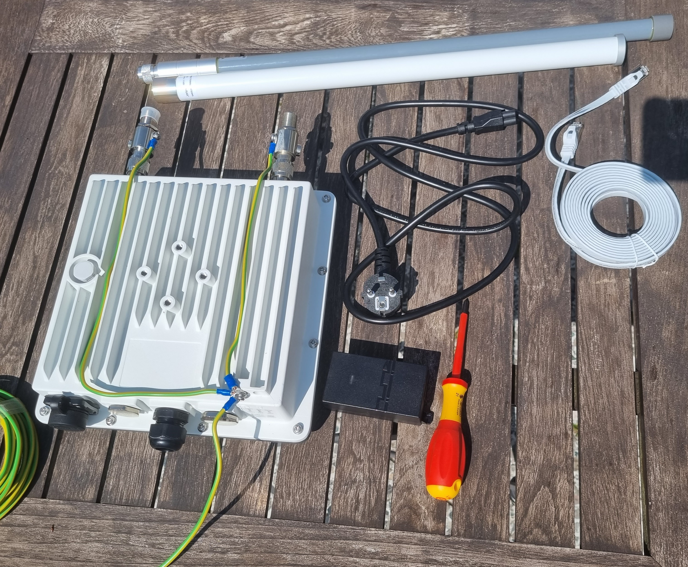
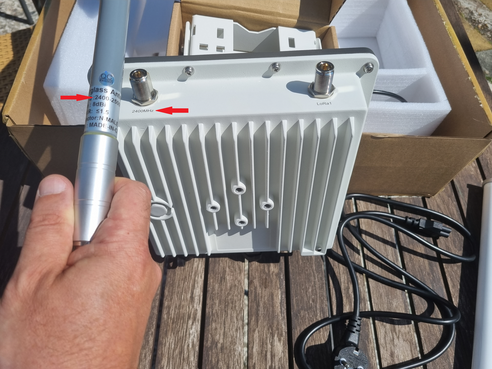

# Installation Summary

1. Unpack the Box and assemble the gateway
2. Mount the gateway outdoors
3. On your phone connect to gateways “wifi access point ex. Chirp-000000”
4. Open the browser on your phone. In the browsers address bar type in 192.168.230.1  
5. Follow the prompts on your phone to register the gateway to your account. After finishing the steps on your phone you will be prompted to continue on the dashboard.
6. Continue the registration on the dashboard. (dashboard address)
7. Submit pictures of the gateway and installation
8. Wait for installation approval

# Installation

## Step One: 

**IMPORTANT! Do not power on the gateway until the antennas are attached to avoid damaging the concentrators.**

To assemble the gateway, attach the antennas to the gateway, ensuring that the antenna frequency matches the gateway frequency. As gateways are high-quality, expensive equipment, it is highly recommended to protect them from lightning and static. It is strongly suggested to install type N lightning arresters (male to female) (not included) between the antennas and the gateway and ground the lightning arresters and the gateway.

## Step Two:

Ground the Lightning Arresters and the gateway with a ground cable.

## Step Three:

Attach the antennas, ensuring they match the frequency.

## Step Four:

You are now ready to mount.

To maximize rewards, it is advisable to mount the miner at the highest available point. By doing so, your miner will offer optimal coverage and increase the likelihood of detecting and connecting with other gateways in the vicinity. This enhanced visibility and connectivity have the potential to generate higher rewards for your mining activities.

