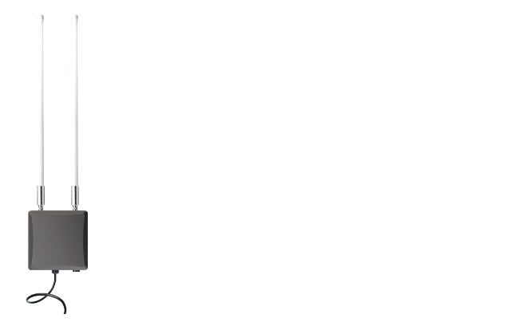

# Installation Scenarios

## Simple Antenna Mount

This is the simplest deployment solution where the antennas are mounted directly onto the gateway. This deployment type is suitable for areas with minimal obstructions where the gateway can easily communicate with the LPWAN devices and has no risk of lightning strikes ie (Balconies). 
