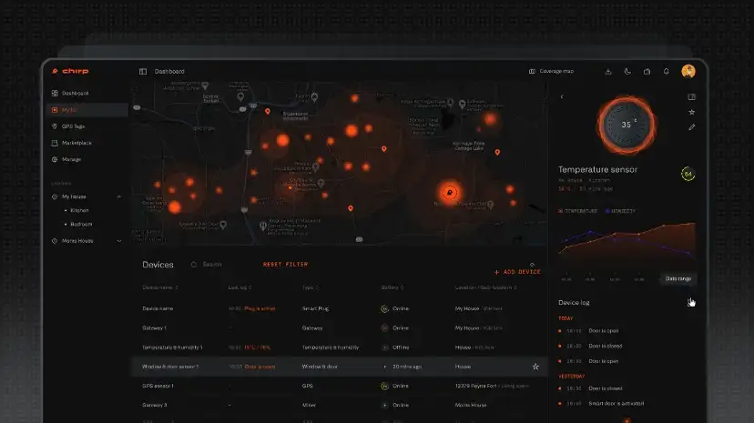

# Chirp’s Non-Miner devices

## IoT Devices

An IoT Device is a small and very low power device that can transmit and receive small quantities of information through the form of data packets, necessary in different IoT applications, to a **[Blackbird](docs/Hardware/Blackbird.md)**, Chirp’s **[IoT Gateway](docs/IoT-Protocols/LoRa/LoRa-Hardware.md)**. 

The lifetime of the average battery powered device is usually on the order of months or years, with some LoRa **[class A](docs/IoT-Protocols/LoRa/LoRa-classes.md)** devices lasting up to 3 years. 

Devices are each made for a specific communication protocol, such as **[LoRa devices](docs/IoT-Protocols/LoRa/LoRa-Hardware.md)**, **[BLE devices](docs/Hardware/BLE-devices.md)** or **Zigbee devices**, and are not often capable to use more than a single communication protocol.

To learn more about example devices for each communication protocol, check out their particular wiki entries:

-	**[LoRa devices](docs/IoT-Protocols/LoRa/LoRa-Hardware.md)**
-	**[BLE devices](docs/Hardware/BLE-devices.md)**
-	**Zigbee devices** (under construction)

## Chirp’s Proprietary Devices

Chirp is working together with existing device manufacturer to produce and launch our unique line of bespoke devices, which can provide the best performance to take better use of the enhanced potential of the **[Blackbird](docs/Hardware/Blackbird.md)** compared to older, Legacy and Existing Networks. 

## Chirp’s Mockingbird

The **[Mockingbird](Mockingbird.md)** is a **Router Repeater** – a device developed to not provide the same functionality as the main **[Blackbird](docs/Hardware/Blackbird.md)** or **[Cardinal](docs/Hardware/Cardinal.md)**, but which is capable to extend the range of the signal provided by the initial device in order to both increase the total range of the network coverage provided, but also to allow the signal to pass around large obstructions that could otherwise impede signal propagation in space – such as going around a large building or the top of a hill.

The **[Mockingbird](Mockingbird.md)** is available for both the **[Cardinal](docs/Hardware/Cardinal.md)** (Fiber Broadband) and the **[Blackbird](docs/Hardware/Blackbird.md)** (IoT) side of Chirp’s Network

## Token Economy Implications

Non-miner devices such as the IoT devices and the End-User Receiver Antenna usually require payments done through a credit card or through **[Chirp Tokens](docs/Chirp-Tokens/chirp-tokens.md)** to provide communication. 

All Miners and Devices appear on the **Dashboard**, the website and mobile app that Chirp Network users can use to see at a glance all of their activity and applications on the Chirp Network. 

