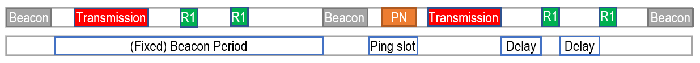
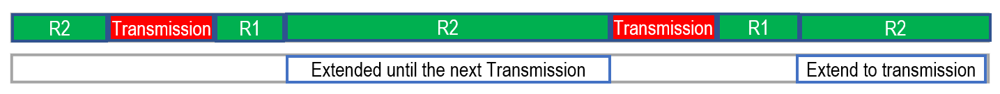

## LoRa Class B and C

# Class B

LoRa Type B keeps the same behaviours as Type A devices, but in addition it schedules a special downlink window, called a Beacon, at fixed intervals, called the Beacon Period, that will be opened to receive data from the Cloud/Server Applications through a Gateway, regardless of whether or when the device sent a Transmission. When at the scheduled Beacon, an announcement that data will be sent to the device, a downlink period called the Ping slot is created.

Unlike Type A devices which can have extremely long time periods where no up- or downlinks are created (no signals are sent or received from the device), a Type B device will always wake up to open a receive window for the scheduled Beacon transmissions. Even when no data is exchanged for long periods of time, the Beacon transmissions will still take place at the scheduled Beacon Periods. 

This makes Type B devices more energy consuming but will lower latency and with the ability to push firmware upgrades, and they can switch to class A at any time. They are often used for applications such as smart utility meters, temperature reporting or accurate GPS location across time.

# Class C

Class C devices are always on. Their receiving window is only stopped when they are transmitting themselves, and are otherwise always listening. They are the only ones that are usually plugged in rather than battery powered because of their increased power consumption, but have significantly reduced latency. This enables type C devices to control physical devices such as valves and switches in real time, opening and closing faucets, turning on and off streetlights, handling a smart irrigation system from a long distance or controlling plenty of other IoT devices.

