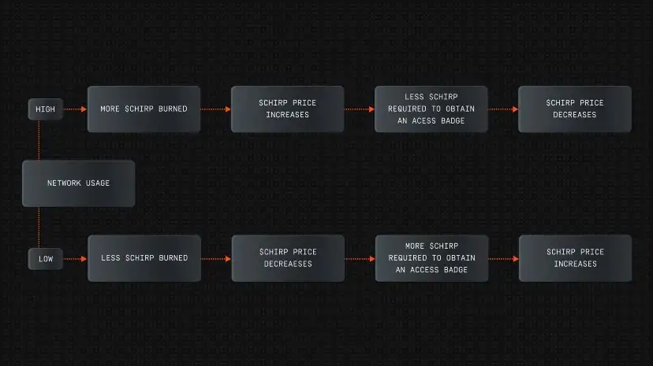

# Token Price Stabilization Mechanism

## Volatility can be tamed

Any person who has been involved in the crypto or financial markets long enough will surely have seen that every once in a while market events or changes in the economy can cause big movements in the apparent value of tokens and cryptocurrencies on the market.

Chirp was designed in a manner that makes it easier to weather the storms of the market, because it is using a deflationary model that changes the number of tokens available, and the price of using the network, proportional to the real usage of the Network.

## A long-term vision

Because of the stabilization mechanisms introduced in Chirp's Tokenomics model, long-term adoption is more efficiently secured, since methods exist through which rewards are not based on temporary and short-sighted schemes, but instead decades of resilient growth. 

The distribution of tokens is spread across years to ensure that sustainable long-term growth can be assured, and nobody will be left behind from receiving lucrative rewards in the future.

The supply of tokens is permanently adjusted depending on how much it is in demand. The Burning Mechanism is a way for the Chirp token to literally transform the revenue of the actual Network Usage into Chirp Token Consumption.
 
## The simple explanation

When many people want to use the Network by installing new devices that communicate with Blackbirds and transfer a lot of data, lots of Chirp tokens get burned at the time of being transformed into access to the network. This makes the total supply smaller, meaning that the same or a greater network value is expressed by fewer tokens – growing the value of the Chirp token. To explore this in more detail, check out the **[High Network Usage Scenario](high-usage.md)**.

When fewer people use the network and growth slows down, fewer Chirp tokens are burned, which means that more will be circulating in the market, and the price for them will be smaller. Since access to the network and data transmitted on the Network always costs the same in dollar (fiat, USD) terms, the same amount of fiat will need to buy more tokens, which will increase the demand of the Chirp tokens on the market, making the price grow and compensate for the decreasing usage. To explore this in more detail, check out the **[Low Network Usage Scenario](low-usage.md)**.

