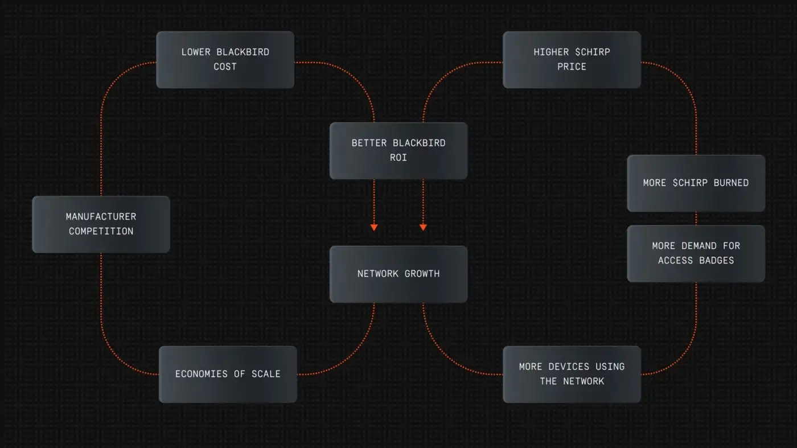

# The Flywheel Model

Pyramid Models often seen in Crypto economies suffer from a lot of volatility and instability, as seen in the extent of the crashes that occur during market downturns. 

Chirp uses a different strategy, optimized for long-term operation and steady and safe growth for the decades of service proposed for the Chirp Network. 

## The Virtuous Cycles

The Chirp Economic Model uses two distinct virtuous, positive loops, that reinforce the improvement of Mining Rewards across time, and the continuous expansion of the Network. These two cycles are based on the following mechanisms:

1.	The token cycle 
2.	The Hardware Cycle

## The Token Cycle

The Token Cycle (1) is based on the fact that increasing usage of the network increases demand for the token, which results in more tokens being removed from the pool, which increases the price of the token, thus making the existing rewards more valuable in exchange for fiat.

This Cycle makes both the token Transaction and Staking more attractive, as well as making the Mining of the Tokens and, consequently, providing coverage better for existing Keepers. This helps securing long-term rewards beyond just rewarding early adopters and covering the cost of the miner, also preventing short-sighted sale of token instead of holding. 

## The Hardware Cycle

The Hardware Cycle (2) is based on economies of scale for the people who partake in the growth of the Network. More Hardware Manufacturers begin competing, making Blackbirds cheaper and increasing coverage and making Devices cheaper and more available, increasing network usage. 

The Hardware Cycle makes usage of the network cheaper and more attractive because of the decrease in the cost and the increase of availability of devices, making it easier for the average person to quickly create an application of the Network that fits their unique needs. 

By increasing Blackbird return on investment and by making Blackbirds cheaper as a result of competition between Manufacturers, it makes increases coverage easier by lowering the barrier to entry and improving the ability of Keepers to reinvest their rewards into installing new Blackbirds.
