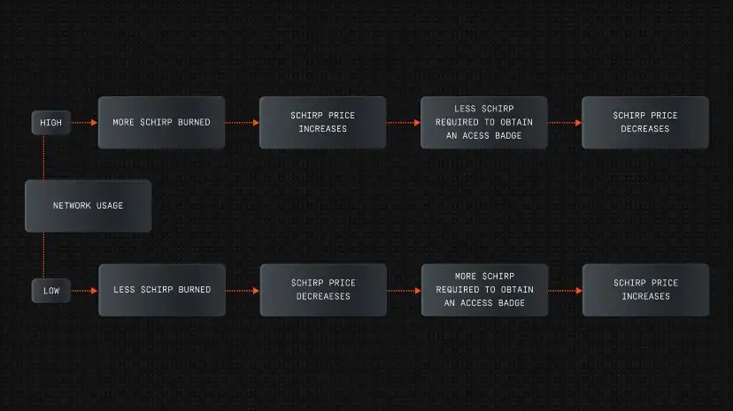

# High Network Usage Scenario

## How does it work?

During accelerated Network Growth, when lots of people scramble to install as many **[Blackbirds](docs/Hardware/Blackbird/Blackbird.md)** as possible and the area of coverage where you can use the Chirp Network increases very fast, the number of **[Chirp Tokens](chirp-tokens.md)** being burned increases, which basically means that the total maximum number of Tokens in the Network decreases. 

The decrease in total supply from burning causes the Price of the **[Chirp Token](chirp-tokens.md)** to increase, because more value is represented by fewer tokens. This is normally called **deflation**, and it is the same mechanism that people tend to associate with “making money more valuable", or "buying more with less".

Because the price of using the Network is expressed in **[Access Badges](access-badges.md)**, which are of fixed value and pegged to USD, fewer **[Chirp Tokens](chirp-tokens.md)** are required to use the network now that the value of the token increased. You can transfer more IoT data on the network with fewer **[Chirp Tokens](chirp-tokens.md)**. Because the dollar cost of IoT data stays the same. 

If the cheaper cost of using the network does not create more usage of the network, which would be the case if lots of people install **[Blackbirds](docs/Hardware/Blackbird/Blackbird.md)** but nobody uses IoT Devices on the Network, the price of **[Chirp Token](chirp-tokens.md)** can decrease, in order to prevent discounting the usage of the network until it does not reflect the real value of providing IoT coverage. The price decrease reverses the cycle, and assures that the total amount of tokens in circulation never falls too far in either extreme, but instead it can be used to reflect the real value of the Network.

## Protecting the Network for long-term growth

Through these mechanisms, it is possible to assure that the value of IoT data is protected and rewards are always scaled according to the real market value of the service that the Chirp Network provides. Often, the push towards limitless growth using get-rich-quick-schemes result in sudden shortfalls once it is realized that in the absence of price stabilization, the access to the Network becomes too expensive or the rewards given to miners are unsustainable, undercutting decades of future growth and adoption for present, short-term, growth.

