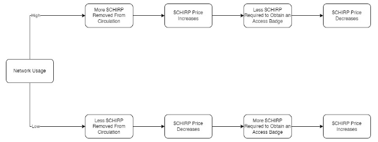

# Long Term Value

## Removing Tokens from Circulation

Access Badges, acquired by converting the equivalent dollar-amount of $CHIRP, are required for user-owned devices to send data on the network. 

This demand for Access Badges on behalf of users is an important indicator of future network usage and also determines the number of $CHIRP tokens that will be taken out of circulation.

The underlying reason to make $CHIRP a de facto  deflationary asset by removing tokens from circulation is to increase the value for existing token holders, which is also an incentive to bring additional gateways onto the network. This occurs by increasing the value of $CHIRP emissions due to increased token scarcity, as any given amount of $CHIRP token emissions received would grow in value and, therefore, increase the value of rewards. This is also a key ingredient to fuel the economic flywheel and further decentralize the network.

## Token Revenue Pool

The tokens that result in network revenue from Access Badges that are taken out of circulation are locked in a specific smart-contract known as the Token Revenue Pool. This ensures that these tokens are effectively taken out of circulation and locked for a specified period of time. This lock-up is expected to be of 10 years, until the token reaches its maximum supply. 

Once the token is fully diluted at the 10-year mark, there should be a governance vote to decide on the destination of the Token Revenue Pool.

## Net Revenue

The amount of $CHIRP that is taken out of circulation corresponds to the entire revenue from Access Badges deducted by any operational and maintenance costs of the network. These costs are those associated with third-party operators that provide services to the network infrastructure.

## Price Stabilization Mechanism

The proposed token model incentivizes the price stability of the free-floating $CHIRP token, due to the fixed USD price of network Access Badges, required for the use of the network. There are two important components in this model. On the demand side, network usage, which generates the removal of tokens from circulation. On the supply side, the value transferred to the network participants via the distribution of emissions, which is an independent process.

$CHIRP price responds to network usage trends, leading to a long-term price appreciation trend.

As the network grows in usage, $CHIRP tokens are removed from circulation and, therefore, the circulating tokens accrue more value. As they grow in value, less tokens need to be removed from circulation, in order to receive the corresponding Access Badges. This is made possible because Access Badges have a predefined price (denominated in USD). The reverse occurs if usage decreases, thus creating a dynamic to bring the price to an equilibrium.

## Locking-up Rewards to Maximize Earnings

Network Keepers are incentivized to lock-up rewards earned through their gateways. This will increase the amount of rewards they receive and is determined by a multiplier factor that increases with time.

The lower end of the multiplier factor changes in an inverse relation to the network demand growth, thus introducing an automatic stabilizer for token liquidity.

If a Network Keeper decides to withdraw any of the earned rewards, its respective multiplier factor will decrease as a percentage of the rewards unlocked.

## Future Network Expansions

Chirp has the aim to become the go-to platform for decentralized global network communications. With this goal in mind, the Token Economy is permeable and able to include adjustments related to new technological deployments. These new technological expansions are rewarded from the Network Keepers’ allocation, for it is intended to follow a decentralized deployment. As these expansions add value to the network, increasing the overall revenue generated by the network, they should reinforce the above mentioned mechanisms of price stabilization and value accrual for the token.

The aim of this expansion strategy is to integrate a system of networks in a coherent manner and based on a single token model to align incentives of all participants.

